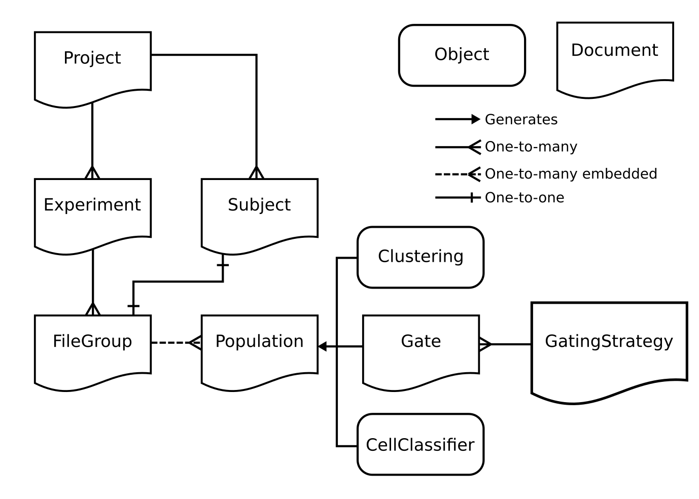
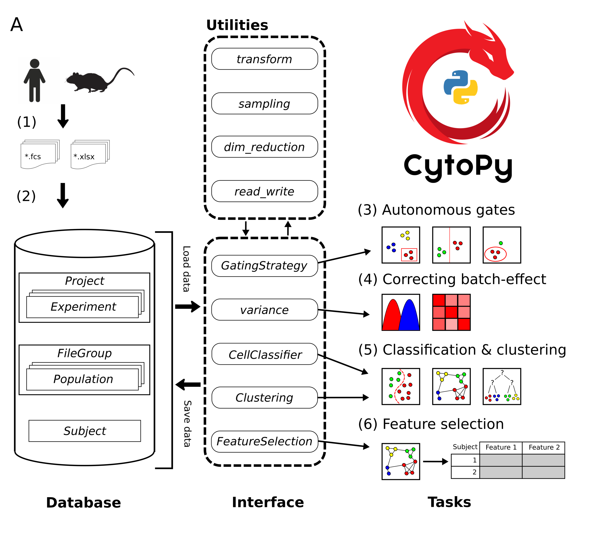
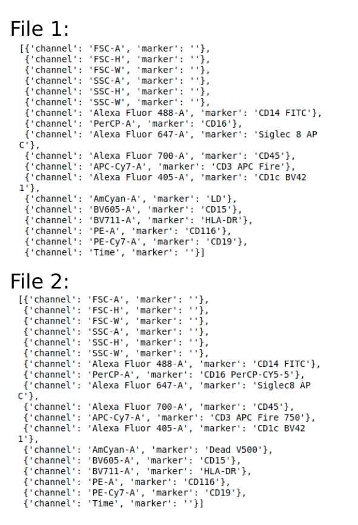
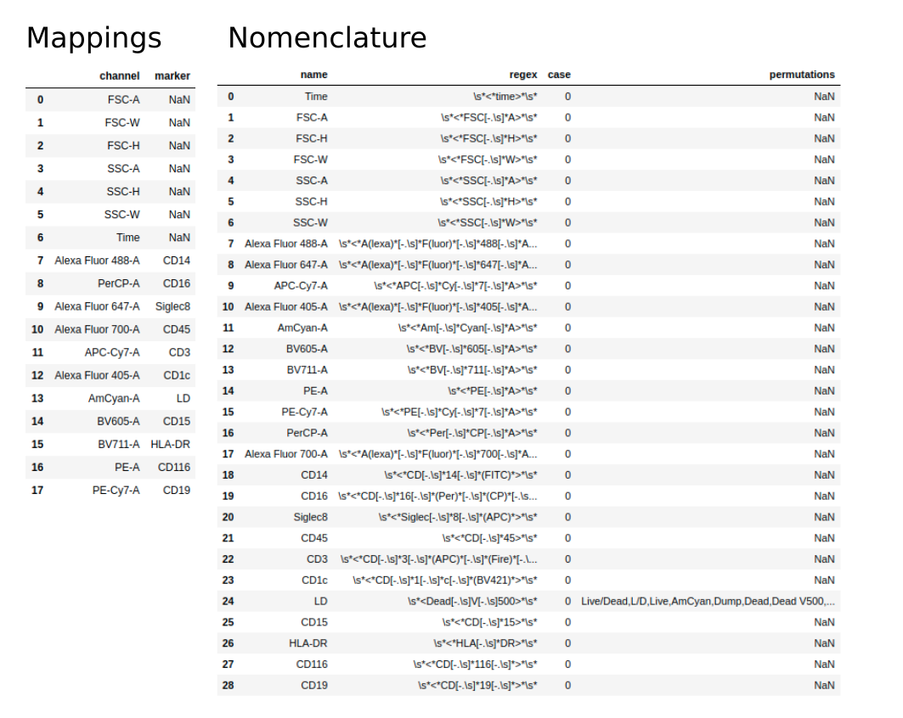

************************************
Creating Projects and managing data
************************************

The CytoPy database is relatively simple in design and there are only a
few elements the user needs to be aware of when creating a database and
managing their data.

Below is a basic schematic of the different elements in the CytoPy database
and how they interact with one another.

The CytoPy framework is built upon `mongoengine <http://mongoengine.org/>`_ an
object-document mapper. Without going into too much detail, each of the
documents in the figure above has it's own class that we can interact with.
For the most part, the user only needs to be concerned with the `Project` class
as the user will use the methods of this class to access all
other documents.

A brief summary of the documents and other objects from the figure above is
given below:

- **Project:** the central control of CytoPy's database and the first thing a user will create when starting a new project. This document is used to create all other documents within the database and to access data as we go back and forth in our analysis.

- **Subject:** for each biological entity in our study e.g a patient, cell line, mouse etc, we create a *Subject* to house any additional meta data. This document is completely dynamic and has no restriction as to how we store data within it.

- **Experiment:** from our *Project* we create *Experiment's*, one for each unique set of staining conditions we are investigating. The *Experiment* handles standardisation of cytometry data as it enters the database. We use an *Experiment* to create and add *FileGroup's*.

- **FileGroup:** a *FileGroup* stores the cytometry data associated to a single biological specimen. The *FileGroup* must contain one file that represents the primary staining of the biological specimen and can additionally store any number of files representing controls such as FMO's or isotype controls.

- **Population:** embedded within each *FileGroup* are *Population's*. These documents define the index of events that pertain to a group of phenotypically similar events. Every *FileGroup* starts with one *Population* by default called 'root' that holds the index for every event in the primary staining. *Population's* are generated by *Gate*, *Clustering* or *CellClassifier*.

- **Gate:** the *Gate* document provides a persistent data structure that defines a manual or autonomous gate. Similar to traditional gating performed by software like FlowJo, the *Gate* document can generate a geometric object in one or two dimensions that encapsulates the members of a *Population*.

- **GatingStrategy:** we never interact with *Gate* documents independently but instead construct them using the *GatingStrategy*. This defines a sequence of *Gate* documents and how they should be applied. The *GatingStrategy* can then be saved to the database and applied to data ad-hoc.

- **Clustering:** another popular strategy for categorising cytometry events is to applying clustering algorithms in high-dimensional space; that is, apply these algorithms to all available events and parameters. The *Clustering* class is an algorithm-agnostic tool that enables you to apply any clustering algorithm to one or many *FileGroup(s)* and generate *Population's*. This class also provides functionality for meta-clustering to match clusters between *FileGroup's*.

- **CellClassifier:** CytoPy offers another strategy for categorising cells and this is using supervised machine learning. A *FileGroup* with existing *Population's* can be used as training data for any supervised classifier within the Scikit-Learn ecosystem, including XGBoost. Additionally, the Keras Sequential API can be used to define deep neural networks.

.. note::
  Do Populations store control file indexes? No, instead CytoPy makes the assumption that primary staining and controls are collected under the same conditions. Therefore, the *Population's* in the primary data serve as ideal training data to predict the *Population's* of control samples. Therefore, when we request a *Population* of a control file in a *FileGroup*, CytoPy uses supervised classification to estimate this *Population*.

There are additional tools and utilities within the framework, notably the
*variance* module for assessing and correcting batch effect, the *plotting*
module for various plotting functions, the *transform* module for transforming
and scaling data, and the *feature_selection* module for feature extraction,
inference testing, and feature selection. A summary of the recommended pathway
for analysis is given in the image below, however the individual modules of
CytoPy can be used independently:

Connecting to the database
##########################

The first step in any analysis is to connect to a database. We don't have to
initialise a database or even create a schema. When we connect to a database
for the first time, it is automatically generated if it does not exist.

We connect to a database using the *global_init* function from *cytopy.data.setup*.
Connections are registered globally, so you only have to call *global_init* once
per session. If working locally you just can name the database::

    from cytopy.data.setup import global_init
    global_init('MyDatabase')

Now the first time that we commit something, a new database will be created
with the name "MyDatabase". If the database is stored on some remote server
we can pass additional arguments to *global_init*::

    global_init('MyDatabase', host='192.168.1.35', port=12345)
    # With authorisation
    global_init('MyDatabase',
                host='mongodb://localhost/production',
                username='admin',
                password='12345')

Setting up a Project
#####################

Once we have a database connection, we can create a *Project*. We need to provide
a name for the project and where we want to store the cytometry data. The cytometry
data is stored as HDF5 files on your local drive and mapped to meta data
in MongoDB::

    # We store HDF5 files on our local drive and provide the path to 'data_directory'
    from cytopy.data.project import Project
    new_project = Project(project_id='TestProject',
                          data_directory='/home/user/CytoPyData')
    new_project.save()

We now have a *Project* to work with and has been committed to the database
by calling the *save* function. Since our *Project* is a mongoengine document
we can retrieve it from the database using their query API::

    new_project = Project.objects(project_id='TestProject').get()

We can use this API to list existing *Project's*::

    # Returns a list of Project documents
    Project.objects()

If we need move the HDF5 data at a later point, this should be done with the
*update_data_directory* function::

    new_project.update_data_directory('/home/user/new/path')

.. warning::
  The *update_data_directory* will move the existing directory by default, it is advised
  not to move this directory manually.

Adding Subjects and meta data
##############################

For each project we will have biological entities we are studying and collecting
biological material from e.g. mice, humans, cell lines etc. To keep track of meta
data about each subject in our study we add *Subject* documents. This document
can also house data that is not sourced from cytometry e.g. plate based assays or mass
spectrometry.

We create a *Subject* using the *add_subject* function of *Project**::

    # We don't have to call save as it is invoked automatically
    new_project.add_subject(subject_id="Our first subject")

The only required field is the *subject_id* but we can pass any number of
additional keyword arguments to create additional fields. They can be of any
type and we can add embedded fields by passing nested dictionaries. Here is an
example of a slightly more complex *Subject*::

    new_project.add_subject(subject_id="Complex",
                            age=43,
                            gender="Male",
                            infection_data={"source": "Blood culture",
                                            "Isolates": [{"name": "E.coli",
                                                          "type": "bacteria"},
                                                         {"name": "Candida albicans",
                                                          "type": "Fungus"}]},
                            elisa_data={"TNFa": 25.3, "IFNg": 13, "IL6": 34.3})

This subject will contain the fields 'age', 'gender', 'infection_data' and 'elisa_data'.
Both 'infection_data' and 'elisa_data' are embedded fields that have additional fields
within them as a nested tree.

We can edit and delete a *Subject* by retrieving the document from the *Project* and
then acting on that *Subject*::

    complex_ = new_project.get_subject(subject_id="Complex")
    # Add a new field
    complex_["diseased"] = True
    # Edit a field
    complex_["age"] = 41
    # Always make sure to save our changes
    complex_.save()
    # We can delete the subject. It will automatically be removed from our project
    complex_.delete()

Adding an Experiment
#####################

To add cytometry data we have to create *Experiment's*, one
for each unique set of staining conditions in our *Project*. An *Experiment*
defines the markers and stains used and standardises cytometry data at the
point of entry.

The problem with cytometry data collected over a long period of time is that you inevitably
end up with inconsistencies between file meta data. This is most problematic for channel and
marker names. An example is shown below with two files with the same staining but
differing marker names for CD16 and live/dead stain:

.. note::
  We can inspect the channel/marker mappings of an FCS file using the
  cytopy.data.read_write.fcs_mappings function

To overcome these complications, all data is normalised upon entry into the
database. An Excel template should be provided with two sheets:

* mappings - expected channel/marker mappings with standardised names to be applied to all files under this staining panel
* nomenclature - how to identify a channel/marker so that it can be standardised

There are examples provided in the Peritonitis analysis notebooks
(https://github.com/burtonrj/CytoPy_Manuscript) and a template can be found
in the CytoPy github `repository <https://github.com/burtonrj/CytoPy/tree/master/assets>`_.

The mappings sheet contains two columns, channel and marker, with each row
specifying a valid pairing. Where a channel does not have a corresponding
marker (and will therefore be referred to using the channel name in analysis)
the marker column should contain a null value.

The nomenclature sheet contains four columns. The first identifies each channel/marker.
Channels and markers are identified and standardised using the regex column and/or the permutations column.
The regex column contains a `regular expression <https://docs.python.org/3/howto/regex.html>`_
used to identify a pattern corresponding to the standardised channel/marker name.

For those unfamiliar with regular expressions, or for cases where the variability
of a channel/marker naming can make regular expressions hard to manage, the permutations
column can be used. Permutations of the standard channel/marker name can be provided
as a comma separated string, where a channel/marker will be matched to the standardised
name based on a like-for-like match to any of the substrings (separated by a comma).

The case column is simply a boolean value that, when true, makes the search case sensitive.

Below we see an example of these two sheets:

Once we have a template we're happy with, we can create an *Experiment* like so::

    new_experiment = new_project.add_experiment(experiment_id="First Experiment",
                                                panel_definition="/path/to/template.xlsx")

The *Experiment* is automatically created, associated to our *Project* and returned to
us in the *new_experiment* variable. If we want to load the *Experiment* back into
our environment we use the *get_experiment* function of *Project*::

    new_experiment = new_project.get_experiment("First Experiment")

We use the *delete_experiment* function to remove an *Experiment*::

    new_project.delete_experiment("First Experiment")

This automatically commits this change to the database and will also delete
associated *FileGroup's*.

Adding cytometry data
######################

Now we have an *Experiment* we can start adding our cytometry data.
Cytometry data can be added using Flow Cytometry Standard files (fcs)
version 2.0, 3.0 or 3.1. Alternatively, cytometry data can be added using a Pandas DataFrame,
allowing data to be imported into CytoPy using various other formats e.g from HDF5 or csv files.

Data is added to an `Experiment` using either the *add_fcs_files* or the
*add_dataframes* method, depending on the input source.

.. note::
  The data itself is stored in CytoPy as raw untransformed values. This is
  because transformations are applied during analysis rather than during
  data entry, to allow the user to experiment with different data transforms.
  Available transforms to apply during any analytical process (found in cytopy.flow.transforms) are:

* `Logicle (biexponential) <https://onlinelibrary.wiley.com/doi/full/10.1002/cyto.a.22030">`_
* `Hyperlog <https://pubmed.ncbi.nlm.nih.gov/15700280/>`_
* `Natural log <https://numpy.org/doc/stable/reference/generated/numpy.log.html>`_
* `Log (base 2) <https://numpy.org/doc/stable/reference/generated/numpy.log2.html>`_
* `Log (base 10) <https://numpy.org/doc/stable/reference/generated/numpy.log10.html>`_
* `Parametrised Log <http://flowcyt.sourceforge.net/gating/latest.pdf>`_
* `Inverse hyperbolic sine transformation <http://flowcyt.sourceforge.net/gating/latest.pdf>`_

  The *transform* module also contains convenient methods for normalising and scaling data
  using the Scikit-Learn catalogue.

For convenience, we can use the *get_fcs_file_paths* to find the absolute paths
for FCS files associated with a single biological specimen::

    from cytopy.data.read_write import get_fcs_file_paths
    fcs_paths =  get_fcs_file_paths("/path/to/specimen/directory",
                                     control_names=["control1", "control2"],
                                     ctrl_id="FMO",
                                     ignore_comp=True,
                                     exclude_dir="DUPLICATE")

In this function we provide the path to the folder containing the FCS files
for a single biological specimen. We provide the name of control files and
a *ctrl_id* which is a keyword used to identify files that are controls i.e.
the file name must contain 'FMO' to be considered a control file. We've also
said to ignore filenames containing the term "compensation" and will ignore
subdirectories containing the term 'DUPLICATE'.

The function expects a single primary staining file (identified by the absence of
the control ID term) and will raise a warning otherwise.

This function returns a dictionary with the keys 'primary' and 'controls', with
values corresponding to the absolute paths to the FCS files.

With the FCS files we can create a *FileGroup* to house them::

    primary = fcs_paths.get("primary")[0]
    controls = fcs_paths.get("controls")
    controls = {x: v[0] for x, v in controls.items()}

    new_experiment.add_fcs_files(sample_id="New File",
                                 primary=primary,
                                 controls=controls,
                                 subject_id="Subject 1",
                                 compensate=True,
                                 verbose=True)

This method takes the following arguments:

* **sample_id**: Unique sample identifier (unique to this Experiment)
* **primary**: File path for primary staining single cell cytometry data
* **controls**: dictionary of filepaths/FCSFiles for single cell cytometry data for control staining e.g. FMOs or isotype controls
* **compensate**: If True, the fcs file will be searched for spillover matrix to apply to compensate data. If a spillover matrix has not been linked to the file, the filepath to a csv file containing the spillover matrix should be provided to 'comp_matrix'
* **comp_matrix** (optional): Path to csv file containing spill over matrix for compensation
* **subject_id** (optional): If a string value is provided, newly generated sample will be associated to this subject
* **verbose** (default=True): If True, progress printed to stdout
* **processing_datetime** (optional): Optional processing datetime string
* **collection_datetime** (optional): Optional collection datetime string
* **missing_error** (default="raise"): How to handle missing channels (channels present in the experiment staining panel but absent from mappings). Should either be "raise" (raises an error) or "warn".

Accessing data
##############

We access our data using the *Experiment* as a portal to our *FileGroup's*. For the most part we can use the various tools in CytoPy and we don't have to touch *FileGroup's* directly, but we can if we want direct access to our data.

To access a *FileGroup* we go via our *Project* and *Experiment*::

    new_project = Project.objects(project_id="TestProject").get()
    new_experiment = new_project.get_experiment("First Experiment")
    file_data = new_experiment.get_sample("New File")

To access the complete data as a *Pandas DataFrame* we use the *data* method::

    # Primary staining
    data = file_data.data(source="primary")
    # Primary staining down sampled
    data = file_data.data(source="primary", sample_size=5000)
    data = file_data.data(source="primary", sample_size=0.5)
    # Control data
    data = file_data.data(source="control1")

To get the data of a particular population we use the *load_population_df*. The
'root' population is generated by default whenever a *FileGroup* is created and
indexes all the events in the primary staining::

    root_data = file_data.load_population_df(population="root", transform="asinh")

This grants us access to the population data of primary staining but to access
controls we use the *load_ctrl_population_df*. This estimates the control
population using the primary staining as training data::

    ctrl_data = file_data.load_ctrl_population_df(ctrl="control1",
                                                  population="pop1",
                                                  classifier="XGBClassifier")

Deleting data
#############

Deleting data is simple, we can use the *delete* method for most documents
and this echos to associated documents automatically.

When we want to delete populations we can either use the *delete_populations*
method of the *FileGroup* containing the populations.

Examples
########

We provide examples of setting up experiments with the Jupyter Notebooks that
accompany our manuscript:

* Setting up `FlowCAP <https://github.com/burtonrj/CytoPyManuscript/blob/main/01%20Validation/setup/Sup.%20Add%20FlowCAP.ipynb>`_
* Setting up the `Peritonitis project <https://github.com/burtonrj/CytoPyManuscript/blob/main/02%20Application/setup/Setup%20project.ipynb>`_

The original Peritonitis dataset can be obtained from this link: https://drive.google.com/file/d/1y6qL_7l2unDoUkNqlr9Xqubq5_sP1E14/view?usp=sharing
