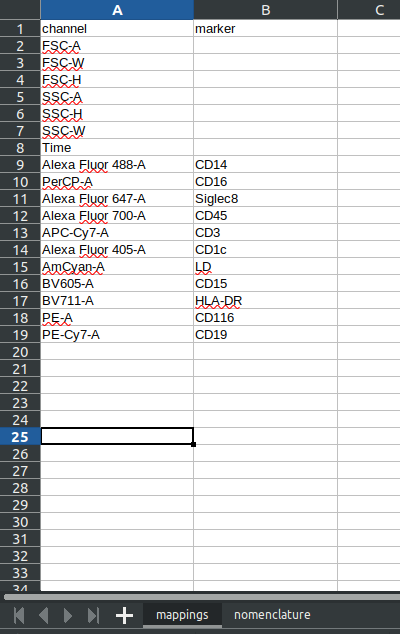
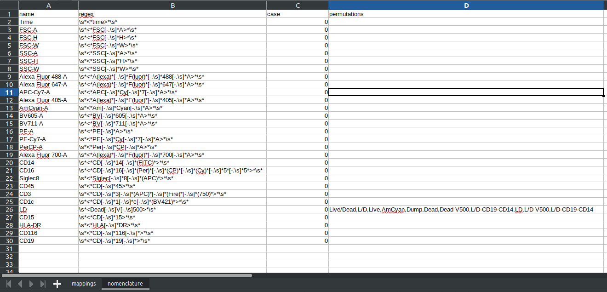

*******************************************
Creating Projects and populating with data
*******************************************

To start any analysis we will need to populate our database. Here we will detail how to connect to a database, create projects, populate those projects with subjects, add experiments, and add \*.fcs files.

Connecting to the database
###########################

If the database is hosted locally, then connecting is simple. We use the *global_init* function at the beginning of our analysis (whether this is in a script or in a notebook). All we have to do is pass the name of our database into this function, for example this will connect to the database called "CytoPy"::
	
	from CytoPy.data.mongo_setup import global_init
	global_init('CytoPy')

If the database does not yet exist, it will automatically be generated. 

If you're connecting to a remote database, you can pass other arguments such as host name and port as keyword arguments. These are passed to a call to mongoengine.connection.register_connection. Please see the mongoengine documentaiton for details.

Currently CytoPy does not support connection to multiple databases at once. All connections default to the alias "core".

Projects & Subjects
#######################

Inside CytoPy all data is contained within MongoDB documents. In the hierarchy of control, the **Project** document is top and controls access to all **Experiments** and contained data. We can start by defining a **Project** like so::
	
	from CytoPy.data.project import Project
	# Create a project for the PD data
	pd_project = Project(project_id='Peritonitis', owner='ross')
	pd_project.save()

We then retrieve this project using the *get* function and the relevant query::
	
	pd_project = Project.objects(project_id='Peritonitis').get()

We use the **Project** document to access all the data within our analysis. A **Project** will have connections to one or more **Subject**'s. A **Subject** can be associated to more than one **Project**.

A **Subject** contains all the metadata related to one individual patient/mouse/cell-line (some biological 'subject'). The **Subject** document is dynamic, that is, we can add any variables we like. In addition to this, there are special embedded documents that can be added to a **Subject**. Multiple embedded documents can be added for each:

* Bug - each **Bug** document details a single microbiological isolate related to the associated subject e.g. if a patient had bacterial pneumonia and *Pseudomonas aeroginosa* had been isolated, you can add a **Bug** document detailing this event (see CytoPy.data.subject.Bug)
* Drug - each **Drug** document details the name of a drug administrated, the initiation data, and the end date (see CytoPy.data.subject.Drug)
* Biology - each **Biology** document details some biological measurement (see CytoPy.data.subject.Biology)

The purpose of these embedded documents is that some metadata is complicated; a subject can have multiple bacterial isolates, many drugs administrated, or many other biological measurements taken. To be able to suitably associate this metadata to our single cell data in exploratory analysis, we must account for this.

A **Subject** can be created and associated to a **Project** like so::

	from CytoPy.data.subject import Subject, Bug, Biology, Drug

	bugs = [Bug(org_name='staph', gram_status='positive'),
		Bug(org_name='e.coli', gram_status='negative')]
	biology = [Biology(test='white_cell_count', result=8000, units='cubic millimeter')] 
	patient = Subject(subject_id='patient_001', peritonitis=True, infection_data=bugs, patient_biology=biology, age=50, gender=1)
	patient.save()
	pd_project.subjects.append(patient)
	pd_project.save()
	

Or using the **Project** API::

	pd_project.add_subject(subject_id='patient_001', 
				peritonitis=True, 
				infection_data=bugs, 
				patient_biology=biology, 
				age=50, 
				gender=1)

Most tasks can be simplified by using the methods CytoPy classes.

A couple of things to highlight from what we just covered:

* Notice that we added a field called 'peritonitis'. This is pretty specific to this project. This doesn't matter because 		  **Subject** is a dynamic document. This means you can add whatever fields you want ad hoc.
* Always remember to save your documents! Changes are not committed to the database unless you call the *save* method.

Adding Cytometry data
######################

To add Cytometry data we have to add an **Experiment** to our project. An **Experiment** houses one or more **FileGroup** documents. Each **FileGroup** represents a biological specimen that can consist of one or more \*.fcs files (primary staining and any controls e.g. Full Minus One or Isotype controls).

An **Experiment** should be generated for each unique staining panel.

Cytometry Panels
*****************
Cytometry data can be related according to some staining profile/panel used to describe the cellular contents of a biological sample. In CytoPy, an **Experiment** must be created for each set of staining conditions. The staining conditions are described by a **Panel** document. 

The **Panel** document is special because it standardises the input of cytometry data at the point of entry. What do I mean by this? Well imagine a user has collected 10 samples, all stained for the same markers, but each time they collected their data they labelled the metadata in their \*.fcs file differently. E.g. in the first sample CXCR3 was labelled "CXCR3", but in the next it was "CXCR 3", then "CXCR-3" and then "cxcr-3" and so on. You can see how this could be an issue when it comes to analysing our data.

To overcome this problem, we introduce the **Panel** document. It contains a description of the expected marker and channel names, the marker and channel names that should be set as standard, and then a regular expression used to match markers and channels to their appropriate standard. If you haven't heard of regular expression before, you can find info here:

* https://docs.python.org/3/howto/regex.html
* https://www.youtube.com/watch?v=ZfQFUJhPqMM

To create a **Panel** we first prepare an Excel template. You can get a blank template here: https://github.com/burtonrj/CytoPy/tree/master/CytoPy/assets

The template Excel spreadsheet contains two sheets:

* Mappings - these are the channel/marker mappings and names of the channels and markers that should be used as standard. The channels and markers will appear with these names throughout your analysis as every file will be standardised accordingly.
* nomenclature - this sheet details, for each channel and each marker standard, a regular expression search term, a list of possible "permutations" and whether the search should be case sensitive. This sheet is used to search each \*.fcs file and match the marker/channel to the appropriate standard name

Below is an example of the mappings sheet for one staining panel in the Peritonitis study detailed in our manuscript:

An example of the nomenclature sheet:

This study spanned over 2 years and so there was a vast array of naming conventions used within the cytometry files provided. Using regular expression and a list of known permutations, we can match the channels and markers to the correct standard.

Templates can be made manually by editing the default template. A useful resource for testing regular expressions is https://regexr.com/

Some convenience functions for exploring the range of channel mappings and creating templates are:

* CytoPy.data.read_write.explore_channel_mappings - given the path to a directory containing one or more \*.fcs files, returns a list of dictionaries for all unique channel/marker names 
* CytoPy.data.read_write.fcs_mappings - given the path to a single \*.fcs file, return the channel/marker names

Once we have our template ready, we can create out **Panel** document::

	from CytoPy.data.panel import Panel
	n_panel = Panel(panel_name='PD_N_Panel')
	n_panel.create_from_excel('path/to/template.xlsx')
	n_panel.save()
	

Or, we can provide the template when generating our **Experiment** and associate it to the **Experiment** at the same time. This is the advised method for creating panels and experiments.

Creating Experiments
********************

As explained above, for each staining condition we are going to create an **Experiment**. It is the **Experiment** that will be used later on to access single cell data. To create a new **Experiment** we use the *add_experiment* method of **Project**::

	from CytoPy.data.project import Project
	pd_project = Project.objects(project_id='Peritonitis').get()
	new_experiment = pd_project.add_experiment('PD_N_Panel', 
					             panel_definition='path/to/template.xlsx'
					             data_directory='path/to/store/single/cell/data')
	                       

By providing the path to our panel template, the **Panel** will be created and automatically associated to our new **Experiment**. Alternatively you can provide *panel_name* instead to associate an existing **Panel** to the **Experiment**.

Notice that we also provide the parameter *data_directory*. Single cell data is large and stored in matrices of float values. CytoPy stores the single cell data to disk in HDF files which are mapped to the **Experiment** in the database. We can change the location of this single cell data store at any time using the *update_data_directory* method of **Experiment**. This makes it easy to migrate data between drives. This means we can migrate the data by just updating the mappings in the database.

To load an experiment from our **Project** we use the *load_experiment* method::

	experiment = pd_project.load_experiment('PD_N_Panel')
	
We load an **Experiment** and interact with that object to create and access single cell data.

Adding \*.fcs files
*******************

\*.fcs files are stored within something called a **FileGroup**. Within a **FileGroup** there should be one primary file and then any other \*.fcs files attributed to controls. We refer to this group of related files as *one biological sample*. So for example if I had three different mice (a, b, and c) and I stained for CD4 and CD8 but had an isotype control for CD4 and CD8 in each, then each mouse would have one **FileGroup** and within each **FileGroup** would be 3 files: the primary staining and two isotype controls.

We add the files for a biological sample like so::

	experiment.add_new_sample(sample_id='patient_001_N', 
			          primary_path='path/to/primary_staining.fcs', 
			          controls_path={'CD27': 'path/to/CD27_FMO.fcs'}, 
			          subject_id='patient_001',
			          compensate=True)

In the method call above we provided the following:

* sample_id: this is the ID we will use to retrieve data from this sample
* primary_path: this is the file path to the primary fcs file
* controls_path (optional): a dictionary with the key corresponding to the 'control_id' and the 'path' where the control file is located as the value
* subject_id (optional): the **Subject** this sample should be referenced too. This will allow metadata to be pulled and associated at a later date
* compensate: whether to apply compensation at the point of entry. CytoPy will search the fcs file for an embedded compensation matrix. If this is not present, the user should provide the path to a csv file of the compensation matrix with the parameter *comp_matrix*.

