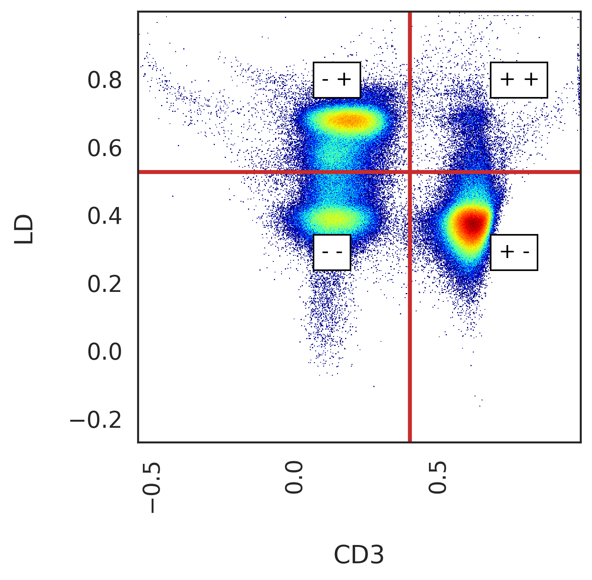
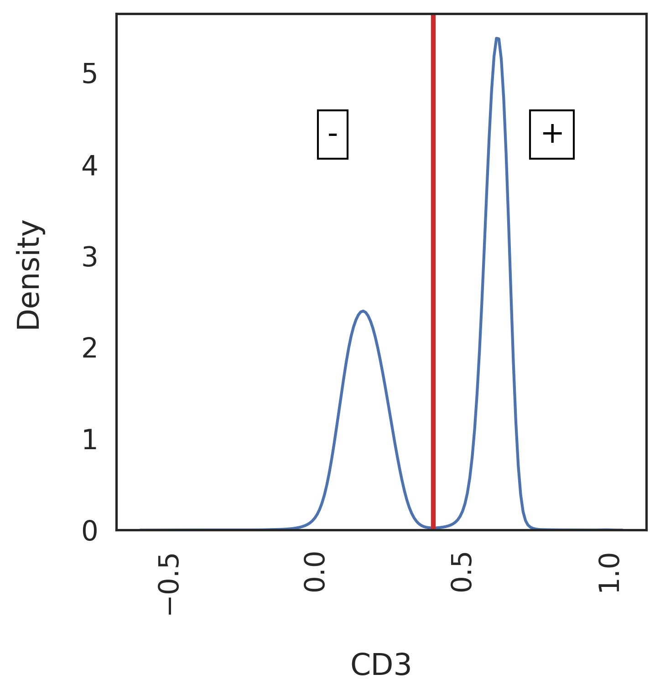
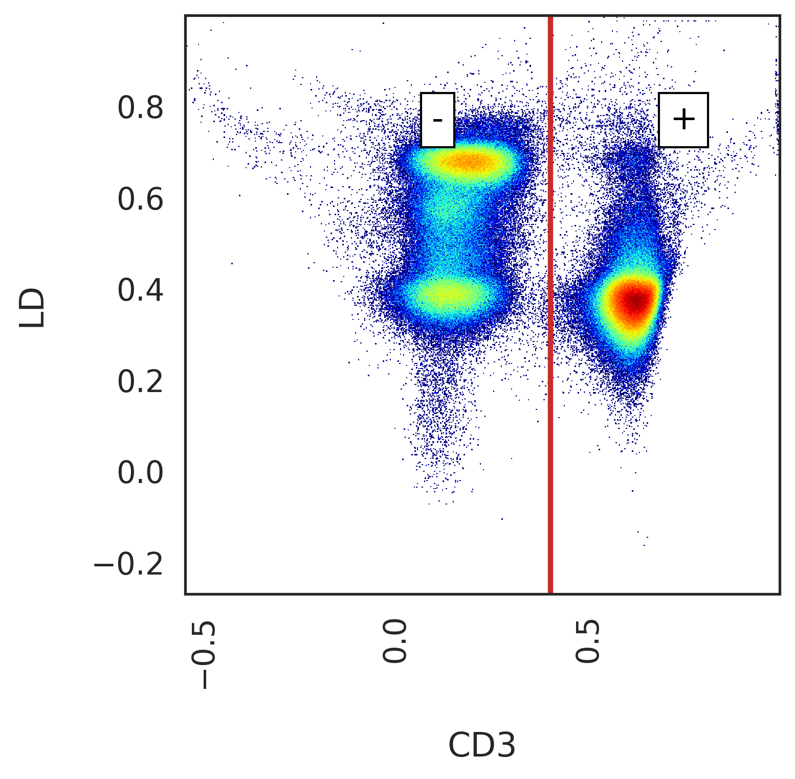
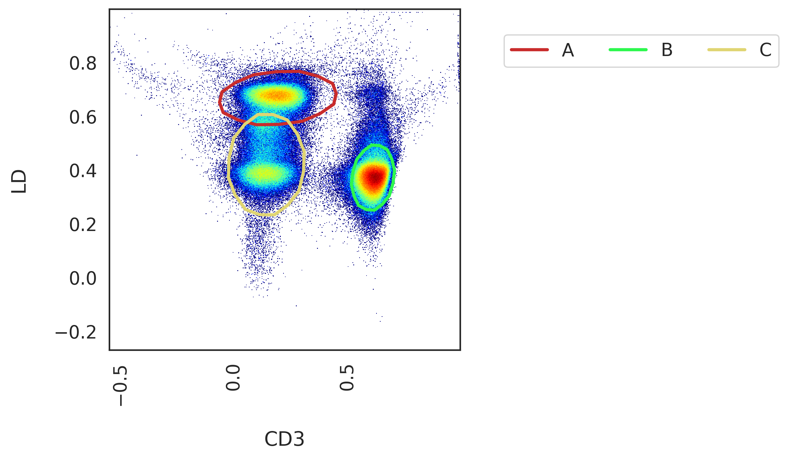

******************
Autonomous gating
******************

We were heavily inspired by the great work of OpenCyto, an autonomous gating framework developed for R Bioconductor. We recognised early on however, that autonomous gating is limited in it's capabilities. First of all, what do we mean by an "autonomous gate".

An autonomous gate is one that replicates the actions of a manual gate by applying some sort of algorithm to the same data in one/two dimensional space. Autonomous gates as a means of automated cytometry analysis have the following issues:

* Being a direct emulation of manual gating, they suffer from the same bias as a manually derived gating strategy
* Unsupervised algorithms are often heavily influenced by hyperparameters, the optimal values of which will deviate from one biological sample to the next
* Algorithms applied in this way don't take into consideration the "global topology" of the immunological landscape that could be captured by considering all available variables

This is why CytoPy focuses instead on using supervised machine learning and high-dimensional clustering that has access to all available variables when modelling the cytometry data and generalise better.

Despite this, we decided to include automated gating as a function of CytoPy. The reason for this is that we found, no matter the quailty of data, some amount of 'gating' is required. Before we can classify cells autonomously we must remove debris, dead cells, and other artifacts. The efficiency and standardisation of this process can be greatly improved through the use of autonomous gates, which we found had good performance for this task.

Pre-processing normally follows these steps:

1. Design a **GatingStrategy** using some chosen example from your **Experiment**, adding **Gate**'s for the populations you want
2. Apply that **GatingStrategy** to each biological sample within an **Experiment**
3. The **GatingStrategy** generates **Population**'s as a result of this gating process and they are saved to the underlying database in each biological samples **FCSGroup**
4. The **GatingStrategy** results in an 'identical' root population being generated for each biological sample e.g. T cells or CD45+ leukocytes. This root population is the point from which supervised classification and high-dimensional clustering take place.

A **Population** is generated whenever a gate is applied or when classified by some supervised classification algorithm. High-dimensional clustering algorithms can be applied to a **Population** and the resulting clusters saved within that **Population**

GatingStrategy & Gate's
########################

The **GatingStrategy** class is used to create and apply gates, generate **Population**s and visualise data. The **GatingStrategy** class is very powerful and we recommend checking out the API reference for details (see CytoPy.data.gating_strategy.GatingStrategy).

Often what we want to do is create a 'gating strategy': a sequence of gates applied to each biological sample, rendering the root population from which we will start more thorough analysis (e.g. CD3+ lymphocytes or CD45+ single live cells). The **GatingStrategy** allows us to add **Gate**'s in sequence using some example data from our **Experiment**. This can then be saved to the database and applied to subsequent data without manual intervention.

We initiate a **GatingStrategy** object and load a **FileGroup** from an **Experiment** like so::

	from CytoPy.data.gating_strategy import GatingStrategy
	# Load the project
	project = Project.objects(project_id='Peritonitis').get()
	# Load the experiment
	exp = project.load_experiment('PD_T_PDMCs')
	# Create a new gating strategy
	template = GatingStrategy(name="T cells", verbose=True)
	# Load a FileGroup (biological sample)
	template.load_data(experiment=exp, sample_id='307-01')
	# Save the template
	template.save()
	
We can save a **GatingStrategy** to the database using the *save* method. When calling this, the associated **FileGroup** is also saved 
with any new **Populations** generated being commited to the database. 

Plotting
*********

When plotting single cell data in one or two dimensional space, behind the scenes the **CreatePlot** class is used. This generates a Matplotlib Axes object upon which data, gates, and **Populations** are plotted. For all plotting methods of the **GatingStrategy**, the plots can be customised by specifying arguments for **CreatePlot** using the *create_plot_kwargs* parameter, a dictionary of keyword arguments. The user should consult CytoPy.flow.plotting for details, but notable mentions are:

* transform_x & transform_y: how the axis should be transformed (see CytoPy.flow.transforms) for available methods; defaults to 'logicle' transform
* xlabel & ylabel: how to label the x and y axis; defaults to the name of the fluorochome/isotype/marker chosen for each axis
* ax: an existing Matplotlib axes object can be provided for additional control
* bins: either an integer value or a string value signifying the method that should be used to estimate bin size for 2D histograms (defaults to "scott" method)
* bw: either a float value or string value signifying the method that should be used to estimate the optimal bandwidth for 1D kde plot (defaults to "scott" method)

**CreatePlot** has numerous methods that **GatingStrategy** will call to plot data. The inputs to these methods can be modified or overwritten by supplying additional keyword arguments (kwargs) to the **GatingStrategy** method. 

For every **FileGroup** there will always be one population present by default. This is called the 'root' population. Not to be confused with what we refer to before. This 'root' is a population that contains all the events in an fcs file. We can plot the 'root' population using the *plot_population* method::

	template.plot_population(population_name='root', 
				  x='FSC-A', 
				  y='SSC-A', 
				  transform_x=None,
				  transform_y=None)

.. image:: images/gating/root.png

Creating and applying a Gate
*****************************

Creating a new gate is performed by the following steps:

1. Define the gate and create a new **Gate** object
2. Preview the **Gate** using the *preview_gate* method of **GatingStrategy**
3. Label the child populations created by the **Gate** object
4. Apply the **Gate** in the **GatingStrategy** using the *apply_gate* method

There are three types of **Gate** objects, all of which inherit their functionality from **Gate**. But you will commonly interact instead with these three subtypes. They are: **ThresholdGate**, **PolygonGate** and **EllipseGate**. There classes are described in detail in the section below titled `Types of Gates`_.

These **Gate** objects are independent of the **GatingStrategy** and instead act on a Pandas DataFrame of single cell data, returning **Population** objects. **Population**'s represent a group of single cell events that are contained within the geometric definitions of a **Gate**. This geometry is described in the **PopulationGeometry**. 

We want gates to be autonomous and data-driven but traditionally we inject our knowledge and understanding of the immune system to 'annotate' populations of interest. In CytoPy, we label the child populations generated when creating our **Gate** using some example data. When we label the child populations, we are telling CytoPy "this is a population I am interested in and I want to identify similar populations in other data you're exposed too". The geometry of the population will be described and saved within the **Gate** object, so when exposed to new data in the future, the same unsupervised algorithm will be applied, generating slightly different results (since it is new data), but the new populations will be labelled by matching them to the original children of the **Gate**.

How does this matching work? CytoPy first calculates the total area overlaping between the geometries. This is then multipled by the minkowski distance between the vector mean of the original child population and the newly discovered population. The new population will inherit the label of the child deemed most 'similar' to it using this score.

So let's go over an example. Say we want to gate live CD3+ cells::

.. image:: images/gating/cd3_ld.png

We would start by defining our **Gate**. We're going to use a **PolygonGate** and the MiniBatchKMeans algorithm from Scikit-Learn (methods we can access will be explained in full in `Types of Gates`_)::

	gate = PolygonGate(gate_name="cd3_live_gate",
		           parent="root",
		           x="CD3",
		           y="LD",
		           transformations={"x": "logicle",
		                            "y": "logicle"},
		           method="MiniBatchKMeans",
		           method_kwargs={"n_clusters": 4,
		                          "batch_size": 1000,
		                          "n_init": 10,
		                          "random_state": 42})
	template.preview_gate(gate)

.. image:: images/gating/MiniBatchKMeans_cd3_ld.png
	
There are some common arguments we provide to a **Gate**, regardless of the type of **Gate** we are using:

* gate_name: the name we want the gate to have in the gating strategy. This will be saved to the database and will be how we refer to the gate in future tasks
* parent: the name of the population this gate is being applied to
* x: name of the variable on the x-axis
* y (optional): if gating two-dimensions, the name of the variable on the y-axis (note: only ThresholdGate supports one dimensional gating)
* transformations: a dictionary describing how each axis should be transformed prior to applying the gate

Note: we can also modify the appearance of the plot generated by passing dictionaries to *create_plot_kwargs* and *plot_gate_kwargs* arguments of *preview_gate*.

When we have previewed the gate, we then label the child populations::

	gate.label_children({"A": "Live CD3+"})
	
We're only interested in that population in the bottom right, so we just label "A". This signifies to CytoPy that the other populations identified are not of interest and will be ignored.

Once they have been labelled, we use the *apply_gate* method and use the argument *add_to_strategy* to associate this **Gate** to the **GatingStrategy**::

	template.apply_gate(gate, add_to_strategy=True)
	
.. image:: images/gating/MiniBatchKMeans_cd3_ld_applied.png

Some simple statistics regarding the newly generated population will also be printed to screen:

.. image:: images/gating/cd3_ld_stats.png

The 'Live CD3+' **Population** is now associated to the **FileGroup** currently connected to the **GatingStrategy**, 'template'. The **Population** will not be saved to the database however until we call the *save* method of **GatingStrategy**. We can view the populations currently stored in the linked **FileGroup** using the *list_populations* method or we can print a population tree using the *print_population_tree* method::

	template.print_population_tree()
	
.. image:: images/gating/pop_tree.png

You can access the **FileGroup** directly by accessing the *filegroup* attribute of the **GatingStrategy**.

Actions
********

There are some processes in the identification of cell populations that falls outside the scope of polygon or threshold gates that subset 'clusters' of cells. The **GatingStrategy** offers the **Action** class (which is embedded within the **GatingStrategy** class) and this allows a user to define merging or subtracting tasks. This **Action** is applied to a target population, *left*, in relation to some other population, *right*. The result is the generation of a new **Population**, either by subtracting the elements of *right* from *left* or by merging *left* with *right*.

As an example, say we had two populations derived from our 'Live CD3+' population, we will call them 'Population A' and 'Population B'. We can create a new population by merging these two, creating a 'Population AB', using an **Action**::

	from CytoPy.data.gating_strategy import Action
	merged_ab = Action(action_name="merge_ab",
			    method="merge",
			    left="A",
			    right="B",
			    new_population_name="AB")
	template.apply_action(action=merged_ab,
			       add_to_strategy=True)

Now when we apply this **GatingStrategy** to new data, gates will be applied in order of their parent population and once the populations "A" and "B" have been generated, this merge operation will be performed.
	
Applying a GatingStrategy to new data
**************************************

Once we're happy with the gates and actions we have added to a **GatingStrategy** we commit it to the database using the *save* method. We can then load an existing **GatingStrategy** using the mongoengine API::

	# Save to database
	template.save()
	# Load a gating strategy
	template = GatingStrategy.objects(name="T cells").get()
	
We can load a new sample into the **GatingStrategy** like before::

	template.load_data(experiment=exp, sample_id='297-02')
	
And either apply gates/actions individually::

	template.apply_gate("cd3_live_gate")
	template.apply_action("merge_ab")
	
Or, use the *apply_all* method to apply all gates and actions at once::

	template.apply_all()

Types of Gates
###############

We described before that there are three different types of **Gate** available for autonomous gating. We will now go through of these and explain their use in detail.

ThresholdGate
**************

The **ThresholdGate** is subsetting data in one or two-dimensions. The class offers accessing to gating either through manual one/two dimensional thresholds (a straight line that seperates data), quantile gates that draw the threshold at the specified quantile of the data it interacts with, or density driven gates that use a novel algorithm that sets the threshold values based on the properties of the estimated probability density function (PDF) of the data encountered.

To specify which method to use, you can change the value of *method* when initializing the object. The value should be 'manual', 'quantile' or 'density'.

The density driven algorithm estimates the PDF for each dimension using convolution based kernel density estimation, provided by the `KDEpy library <https://kdepy.readthedocs.io/en/latest/>`. A `peak find algorithm <https://github.com/demotu/detecta>` is applied and the following performed:

1. If a single peak is found, the threshold is drawn at the inflection point between the local maxima and the minima to the right of the peak. This can be reversed to draw the threshold at the left of the peak by passing \{"inflection_point_kwargs": {"incline": True\}\} to *method_kwargs*. 
2. If two peaks are found, then the threshold is drawn at the local minima between the two peaks
3. If more than two peaks are found, then the PDF is 'smoothed' using a Savitzky-Golay filter. The algorithm is rerun until 2 or less peaks are found, with the window of the filter increased at each iteration

Lets see an example of the **ThresholdGate** applied to identifying the CD3+ population we saw before::

	gate = ThresholdGate(gate_name="cd3_live_gate",
		             parent="root",
		             x="CD3",
		             y="LD",
		             transformations={"x": "logicle",
		                              "y": "logicle"},
		             method="density",
		             method_kwargs={"min_peak_threshold": 0.05,
		                            "peak_boundary": 0.1})
	template.preview_gate(gate)
	

Additional keyword arguments used to manipulate the behaviour of the underlying algorithm are passed as a dictionary to *method_kwargs*. This is the case for all the **Gate** classes. We would then label the resulting populations just as before using the *label_children* method and then apply the gate.

The **ThresholdGate** provides the same functionality for gating in a single dimension. For example, we could gate just along the CD3+ axis::

	gate = ThresholdGate(gate_name="cd3_gate",
		             parent="root",
		             x="CD3",
		             transformations={"x": "logicle"},
		             method="density")
	template.preview_gate(gate)

If we want the gate applied to a single axis but plotted on two dimensions, we can modify the plot by passing the following to the *preview_gate* method::

	template.preview_gate(gate, plot_gate_kwargs={"y": "LD",
                                                      "transform_y": "logicle"})
                                                      

PolygonGate
************

The **PolygonGate** does as it's name describes, it generates polygon shapes, or 'gates', that encircle events to create **Populations**. A **PolygonGate** can create one or more polygon shapes at once (stored as a **PolygonGeom**, which inherits from **PopulationGeom**). These shapes are formed by calculating the convex envolope of the clustering assignments of a clustering algorithm. Alternatively the user can also create static gates by setting *method* to 'manual' and providing polygon coordinates as 'x_values' and 'y_values' in *method_kwargs*.

As for the algorithms available, the **PolygonGate** provides access to any clustering algorithm from the popular Scikit-Learn *cluster* module. Additionally, the `HDBSCAN <https://hdbscan.readthedocs.io/en/latest/how_hdbscan_works.html>` library is also accessible. CytoPy's design is such that it uses the common Scikit-Learn signature for these algorithms. If you know of or have an unsupervised clustering algorithm that you would like included, that follows the Scikit-Learn template, please make a pull request at our `Github repository <https://github.com/burtonrj/CytoPy>` or contact us at burtonrj@cardiff.ac.uk.

Using an algorithm is simple, we specify the class name in *method*, like we did before when gating live CD3+ cells, where we used mini-batch K means. The parameters that you would pass to initiate the scikit-learn object are given as a dictionary in *method_kwargs*.

EllipseGate
************

The **EllipseGate** inherits all functionality of the **PolygonGate** and is similar in many ways. The difference is that elliptical gates are generated instead of polygons, and this is achieved using probabilistic models from the `Scikit-Learn *mixture* module <https://scikit-learn.org/stable/modules/mixture.html#mixture>`.

The shapes themselves are generated by drawing a confidence interval around the models components, creating elliptical 'gates'. The confidence intervals themselves are estimated from the covariance matrices of each component and because of this, only 'full' covariance type is supported.

An example of gating live CD3+ cells is shown below when using Gaussian mixture models::

	gate = EllipseGate(gate_name="cd3_gate",
		           parent="root",
		           x="CD3",
		           y="LD",
		           transformations={"x": "logicle",
		                            "y": "logicle"},
		           method="GaussianMixture",
		           method_kwargs={"n_components": 3})
	template.preview_gate(gate)
	

Some more examples of popular clustering algorithms that can be accessed for autonomous gates are shown in the figure below.

.. image:: images/gating/algo_examples.png

Editing a GatingStrategy & FileGroup
#####################################

We all know that sometimes not everything goes to plan. This is true for autonomous analysis as it is for any analysis and it is easy for an autonomous gate to misclassify data due to a technical error in our data that we did not anticipate. For this reason it is vital that we can interfer and edit our **GatingStrategy** and/or **FileGroup**.

Deleting populations
*********************

If we want to delete a population, we can use the *delete_populations* method of either the underlying **FileGroup** or the **GatingStrategy**. We simply provide a list of populations we want to delete::

	# These two commands do the same thing:
	template.filegroup.delete_populations(['A', 'B'])
	template.delete_populations(['A', 'B'])
	
Remember, we can access the **FileGroup** using the *filegroup* attribute of the **GatingStrategy**. You can also load a **FileGroup** directly from the **Experiment**::
	
	filegroup = exp.get_sample('297-02')
	filegroup.delete_populations(['A', 'B'])

.. warning:: When you delete a Population, all Populations that are 'downstream' (that is, they are the parent/grandparent/great-grandparent etc) will also be deleted. You cannot delete the 'root' population.

.. note:: The removal of population will not be made permanent until the *save* method has been called either on the FileGroup directly or on the GatingStrategy it is currently loaded into

Deleting gates
***************

Deleting a gate is simple, we specify the gate name and delete with the *delete_gate* method::

	template.delete_gate('cd3_live_gate')
	
.. warning:: When you delete a gate this **does not** propagate to Populations that have been generated by this gate. They must be removed manually.

Editing a gate
***************

We can edit a gate using the *edit_gate* method. We simply specify the name of the gate and update the 'geometry' that defines the gate. For a threshold gate this is the *x_threshold* and also the *y_threshold* if the gate is applied in two dimensions. For a polygon gate/ellipse gate we specify the new x and y coordingates in *x_values* and *y_values* respectively. Example code for modifying a threshold::

	template.edit_gate(gate_name='cd3_live_gate',
			    x_threshold=0.6,
			    y_threshold=0.8)

This would update the threshold gate 'cd3_live_gate' and resulting **Populations** for the **FileGroup** currently associated to our **GatingStrategy**. The immediate **Populations** (the ones generated by this gate directly) will be modified to fall within the bounds of the new geometry. Gates that occur downstream of this one (where the parent population is downstream of the populations generated by the modified gate) will be applied **statically**; the geometries as they were first defined will be applied to the newly generated populations. Therefore it is important to check that the change is not so dramatic that the subsequent gates need changing!

Deleting a GatingStrategy
**************************

If you wish to delete a GatingStrategy, then you can use the *delete* method. Use the *delete_gates* and *remove_associations* arguments to modify behaviour:

* delete_gates: this will also delete all gates associated to this gating strategy from the database (defaults to True)
* remove_associations: this will iterate through all the **FileGroup** objects in your database and delete populations generated from this **GatingStrategy** (defaults to True)

Using control data
###################

An experimental feature of CytoPy is the ability to use control data to influence autonomous gating. We can specify that the **Gate** (whether that be a threshold, polygon, or ellipse) be 'fitted' to the data from a control sample and then the resulting geometric shape defining the gate applied to the data from the primary staining. In this way we can use FMO or isotype controls to influence our gates.

To do this, we simply specify the name of the control sample we would like to use when we define our **Gate** object. The control must be available in all future **FileGroup**'s that the **GatingStrategy** encounters. To see what controls are available in the current **FileGroup** loaded into our object, we can do the following::

	template.filegroup.controls
	>>> ['CD57', 'CD27', 'CD45RA', 'CCR7']
	
A definition like this, would result in a gate that uses the CCR7 FMO control to generate the gate and then apply the resulting gate to the original stainings::

	gate = ThresholdGate(gate_name="ccr7_ctrl_gate",
		             parent="Live CD3+",
		             x="CCR7",
		             y="CD45RA",
		             ctrl="CCR7",
		             transformations={"x": "logicle",
		                              "y": "logicle"},
		             method="density")
		             
The parent population that the gate is applied to is estimated in the control data by fitting a K nearest neighbours classifier to the primary data and using the resulting model to estimate the population in the control data, under the assumption that the stating conditions should be similar. The number of neighbours to use in this process is estimated using grid search hyperparameter tuning.

