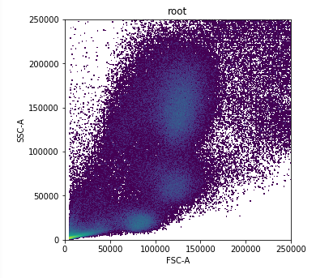
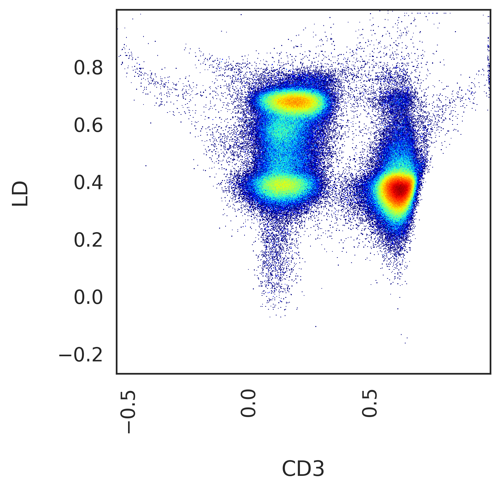
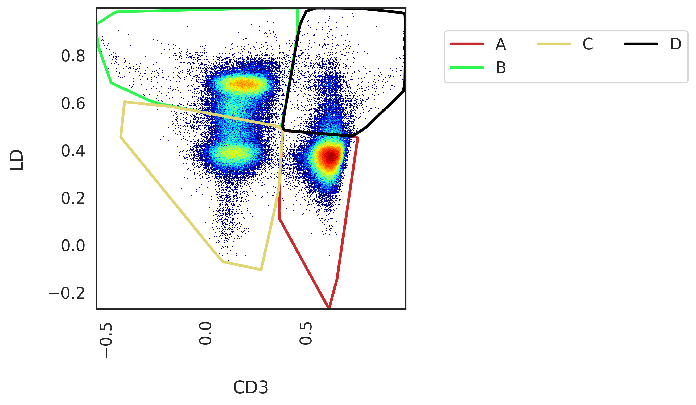
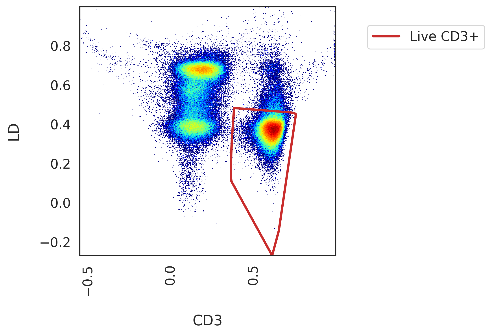
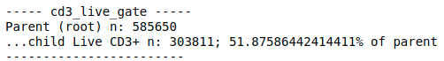
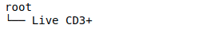

*************************************
Autonomous gating and pre-processing
*************************************

We were heavily inspired by the great work of OpenCyto, an autonomous gating framework developed for R Bioconductor. We recognised early on however, that autonomous gating is limited in it's capabilities. First of all, what do we mean by an "autonomous gate".

An autonomous gate is one that replicates the actions of a manual gate by applying some sort of algorithm to the same data in one/two dimensional space. Autonomous gates as a means of automated cytometry analysis have the following issues:

* Being a direct emulation of manual gating, they suffer from the same bias as a manually derived gating strategy
* Unsupervised algorithms are often heavily influenced by hyperparameters, the optimal values of which will deviate from one biological sample to the next
* Algorithms applied in this way don't take into consideration the "global topology" of the immunological landscape that could be captured by considering all available variables

This is why CytoPy focuses instead on using supervised machine learning and high-dimensional clustering that has access to all available variables when modelling the cytometry data and generalise better.

Despite this, we decided to include automated gating as a function of CytoPy. The reason for this is that we found, no matter the quailty of data, some amount of 'gating' is required. Before we can classify cells autonomously we must remove debris, dead cells, and other artifacts. The efficiency and standardisation of this process can be greatly improved through the use of autonomous gates, which we found had good performance for this task.

Pre-processing normally follows these steps:

1. Design a **GatingStrategy** using some chosen example from your **Experiment**, adding **Gate**'s for the populations you want
2. Apply that **GatingStrategy** to each biological sample within an **Experiment**
3. The **GatingStrategy** generates **Population**'s as a result of this gating process and they are saved to the underlying database in each biological samples **FCSGroup**
4. The **GatingStrategy** results in an 'identical' root population being generated for each biological sample e.g. T cells or CD45+ leukocytes. This root population is the point from which supervised classification and high-dimensional clustering take place.

A **Population** is generated whenever a gate is applied or when classified by some supervised classification algorithm. High-dimensional clustering algorithms can be applied to a **Population** and the resulting clusters saved within that **Population**

GatingStrategy & Gate's
########################

The **GatingStrategy** class is used to create and apply gates, generate **Population**s and visualise data. The **GatingStrategy** class is very powerful and we recommend checking out the API reference for details (see CytoPy.data.gating_strategy.GatingStrategy).

Often what we want to do is create a 'gating strategy': a sequence of gates applied to each biological sample, rendering the root population from which we will start more thorough analysis (e.g. CD3+ lymphocytes or CD45+ single live cells). The **GatingStrategy** allows us to add **Gate**'s in sequence using some example data from our **Experiment**. This can then be saved to the database and applied to subsequent data without manual intervention.

We initiate a **GatingStrategy** object and load a **FileGroup** from an **Experiment** like so::

	from CytoPy.data.gating_strategy import GatingStrategy
	# Load the project
	project = Project.objects(project_id='Peritonitis').get()
	# Load the experiment
	exp = project.load_experiment('PD_T_PDMCs')
	# Create a new gating strategy
	template = GatingStrategy(name="T cells", verbose=True)
	# Load a FileGroup (biological sample)
	template.load_data(experiment=exp, sample_id='307-01')
	# Save the template
	template.save()
	
We can save a **GatingStrategy** to the database using the *save* method. When calling this, the associated **FileGroup** is also saved 
with any new **Populations** generated being commited to the database. 

Plotting
*********

When plotting single cell data in one or two dimensional space, behind the scenes the **CreatePlot** class is used. This generates a Matplotlib Axes object upon which data, gates, and **Populations** are plotted. For all plotting methods of the **GatingStrategy**, the plots can be customised by specifying arguments for **CreatePlot** using the *create_plot_kwargs* parameter, a dictionary of keyword arguments. The user should consult CytoPy.flow.plotting for details, but notable mentions are:

* transform_x & transform_y: how the axis should be transformed (see CytoPy.flow.transforms) for available methods; defaults to 'logicle' transform
* xlabel & ylabel: how to label the x and y axis; defaults to the name of the fluorochome/isotype/marker chosen for each axis
* ax: an existing Matplotlib axes object can be provided for additional control
* bins: either an integer value or a string value signifying the method that should be used to estimate bin size for 2D histograms (defaults to "scott" method)
* bw: either a float value or string value signifying the method that should be used to estimate the optimal bandwidth for 1D kde plot (defaults to "scott" method)

**CreatePlot** has numerous methods that **GatingStrategy** will call to plot data. The inputs to these methods can be modified or overwritten by supplying additional keyword arguments (kwargs) to the **GatingStrategy** method. 

For every **FileGroup** there will always be one population present by default. This is called the 'root' population. Not to be confused with what we refer to before. This 'root' is a population that contains all the events in an fcs file. We can plot the 'root' population using the *plot_population* method::

	template.plot_population(population_name='root', 
				  x='FSC-A', 
				  y='SSC-A', 
				  transform_x=None,
				  transform_y=None)

Creating and applying a Gate
*****************************

Creating a new gate is performed by the following steps:

1. Define the gate and create a new **Gate** object
2. Preview the **Gate** using the *preview_gate* method of **GatingStrategy**
3. Label the child populations created by the **Gate** object
4. Apply the **Gate** in the **GatingStrategy** using the *apply_gate* method

There are three types of **Gate** objects, all of which inherit their functionality from **Gate**. But you will commonly interact instead with these three subtypes. They are: **ThresholdGate**, **PolygonGate** and **EllipseGate**. There classes are described in detail in the section below titled `Types of Gates`_.

These **Gate** objects are independent of the **GatingStrategy** and instead act on a Pandas DataFrame of single cell data, returning **Population** objects. **Population**'s represent a group of single cell events that are contained within the geometric definitions of a **Gate**. This geometry is described in the **PopulationGeometry**. 

We want gates to be autonomous and data-driven but traditionally we inject our knowledge and understanding of the immune system to 'annotate' populations of interest. In CytoPy, we label the child populations generated when creating our **Gate** using some example data. When we label the child populations, we are telling CytoPy "this is a population I am interested in and I want to identify similar populations in other data you're exposed too". The geometry of the population will be described and saved within the **Gate** object, so when exposed to new data in the future, the same unsupervised algorithm will be applied, generating slightly different results (since it is new data), but the new populations will be labelled by matching them to the original children of the **Gate**.

How does this matching work? CytoPy first calculates the total area overlaping between the geometries. This is then multipled by the minkowski distance between the vector mean of the original child population and the newly discovered population. The new population will inherit the label of the child deemed most 'similar' to it using this score.

So let's go over an example. Say we want to gate live CD3+ cells::

We would start by defining our **Gate**. We're going to use a **PolygonGate** and the MiniBatchKMeans algorithm from Scikit-Learn (methods we can access will be explained in full in `Types of Gates`_)::

	gate = PolygonGate(gate_name="cd3_live_gate",
		           parent="root",
		           x="CD3",
		           y="LD",
		           transformations={"x": "logicle",
		                            "y": "logicle"},
		           method="MiniBatchKMeans",
		           method_kwargs={"n_clusters": 4,
		                          "batch_size": 1000,
		                          "n_init": 10,
		                          "random_state": 42})
	template.preview_gate(gate)

	
There are some common arguments we provide to a **Gate**, regardless of the type of **Gate** we are using:

* gate_name: the name we want the gate to have in the gating strategy. This will be saved to the database and will be how we refer to the gate in future tasks
* parent: the name of the population this gate is being applied to
* x: name of the variable on the x-axis
* y (optional): if gating two-dimensions, the name of the variable on the y-axis (note: only ThresholdGate supports one dimensional gating)
* transformations: a dictionary describing how each axis should be transformed prior to applying the gate

Note: we can also modify the appearance of the plot generated by passing dictionaries to *create_plot_kwargs* and *plot_gate_kwargs* arguments of *preview_gate*.

When we have previewed the gate, we then label the child populations::

	gate.label_children({"A": "Live CD3+"})
	
We're only interested in that population in the bottom right, so we just label "A". This signifies to CytoPy that the other populations identified are not of interest and will be ignored.

Once they have been labelled, we use the *apply_gate* method and use the argument *add_to_strategy* to associate this **Gate** to the **GatingStrategy**::

	template.apply_gate(gate, add_to_strategy=True)
	

Some simple statistics regarding the newly generated population will also be printed to screen:

The 'Live CD3+' **Population** is now associated to the **FileGroup** currently connected to the **GatingStrategy**, 'template'. The **Population** will not be saved to the database however until we call the *save* method of **GatingStrategy**. We can view the populations currently stored in the linked **FileGroup** using the *list_populations* method or we can print a population tree using the *print_population_tree* method::

	template.print_population_tree()
	

You can access the **FileGroup** directly by accessing the *filegroup* attribute of the **GatingStrategy**.

Actions
********

There are some processes in the identification of cell populations that falls outside the scope of polygon or threshold gates that subset 'clusters' of cells. The **GatingStrategy** offers the **Action** class (which is embedded within the **GatingStrategy** class) and this allows a user to define merging or subtracting tasks. This **Action** is applied to a target population, *left*, in relation to some other population, *right*. The result is the generation of a new **Population**, either by subtracting the elements of *right* from *left* or by merging *left* with *right*.

As an example, say we had two populations derived from our 'Live CD3+' population, we will call them 'Population A' and 'Population B'. We can create a new population by merging these two, creating a 'Population AB', using an **Action**::

	from CytoPy.data.gating_strategy import Action
	merged_ab = Action(action_name="merge_ab",
			    method="merge",
			    left="A",
			    right="B",
			    new_population_name="AB")
	template.apply_action(action=merged_ab,
			       add_to_strategy=True)

Now when we apply this **GatingStrategy** to new data, gates will be applied in order of their parent population and once the populations "A" and "B" have been generated, this merge operation will be performed.
	
Applying a GatingStrategy to new data
**************************************

Types of Gates
###############

ThresholdGate
**************

PolygonGate
************

EllipseGate
************

Editing a GatingStrategy & FileGroup
#####################################

Deleting populations
*********************

Deleting gates
***************

Editing a gate
***************

Using control data
###################

Other worthy mentions
######################

I hope we have demonstrated so far that the **Gating** class is very powerful and we recommend reading the the API reference at CytoPy.flow.gating.actions for more details.

As for other functions contained within **Gating**, worthy mentions are:

* get_population_df: given a population name, returns the Pandas DataFrame of events within the population. Has options to transform the data according to any of the transform function avaiable in CytoPy.flow.transforms. Also has an option to label events according to the downstream populations they belong too. If a value for *ctrl_id* is provided, the equivalent population in the given control is returned instead of the primary data
* population_size: returns the total number of events within a population
* merge: given two populations with the same parent, creates a new gate and a resulting population that is the merger of these two populations
* subtraction: given a target population and any number of other populations that share the same parent, subtract the other populations from the target, generating a new population. The defintion is saved within a gate and can be saved within a template.
* remove_population: removes a population and all downstream dependencies (optional but recommended)
* remove_gate: removes a gate and, if specified to do so, removes all associated populations
* register_as_invalid: registers the currently loaded sample as invalid and saves flag to database
* check_downstream_overlaps: checks if a population is downstream to any number of other populations

