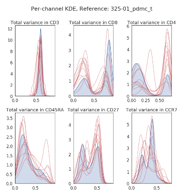
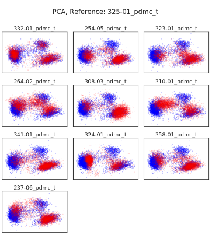
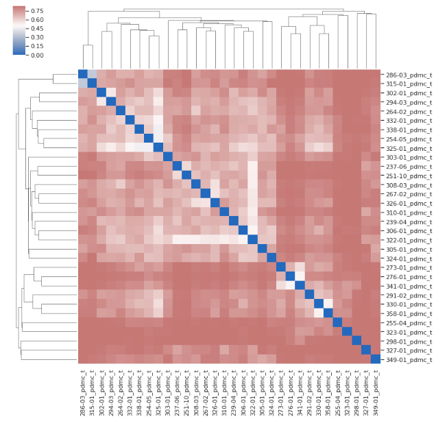

*************************************
Assessment of inter-sample variation
*************************************

In the previous chapter we introduced autonomous gating as a method for classifying single cells in cytometry data. We also mentioned how this method can fail due to the heterogenity of this data, especially in studies that have involved data acquisition that spans months or even years. For such studies we advise that autonomous gating be used for pre-processing purposes only.

For a detailed classification of the single cell data in a **FileGroup** you can use the supervised classification tools provided by **CellClassifier** or high-dimensional clustering (e.g. using FlowSOM or PhenoGraph) using **Clustering** class.

For supervised classification we want to take into account inter-sample variation when choosing training data; this will be a representative **FileGroup** that is annotated using gates. Unless all of your biological samples were processed at the same time and all cytometry data acquired in the same run, there will be inter-sample variation introduced not just from biological differences between subjects but also as a result of "batch effect". We recognised that it is important that we can explore and examine inter-sample variation prior to an extensive analysis. This is what the **variance** module is designed for.

Loading data for analysis
==========================

The **variance** module provides a function to load data from an **Experiment** and downsample the data to make it more managable. This is aptly named *load_and_sample* and is used as such::
	
	from CytoPy.data.project import Project
	from CytoPy.flow.variance import load_and_sample
	pd_project = Project.objects(project_id='Peritonitis').get()
	exp = pd_project.load_experiment('PD_T_PDMCs')
	data = load_and_sample(experiment=exp,
				population='T cells',
				sample_size=5000,
				sampling_method='uniform',
				transform='logicle')

This function will sample every **FileGroup** of the **Experiment** and returns an ordered dictionary, where the key value is the sample ID and the value a Pandas DataFrame of events sampled from the specified population in the respective **FileGroup**. Sampling methods can be one of 'uniform', 'density' or 'faithful'. See CytoPy.flow.sampling for details.

Choosing a reference sample
=============================

CytoPy offers tools to visualise inter-sample variation. Some of these tools contrast the variation in samples with a chosen reference sample. The reference sample is chosen as the sample that alligns closest to all other samples. We choose this reference sample using the *calculate_ref_sample* function.

This function borrows the idea presented in Li H et al (doi: 10.1093/bioinformatics/btx448). In brief, CytoPy performs a pairwise computation of the Euclidean norm of each sample’s covariance matrix, and selects the sample with the smallest average distance as reference. 

To generate a reference sample we simply pass the ordered dictionary generated from *load_and_sample*::

	from CytoPy.data.project import Project
	from CytoPy.flow.variance import calculate_ref_sample
	calculate_ref_sample_fast(data)
	# This returns the sample ID '325-01', our reference sample

Visualising univariant differences
===================================

The first thing we might want to do is visualise the inter-sample variation for individual cell markers measured. We can do this by comparing the estimated PDF (using a Gaussian KDE) of each marker, for each sample, constrasted to the reference sample.

This is greatly simplified in CytoPy, which provides convenience functions for tasks such as this. To produce a grid of KDE plots, with samples overlaid on some reference sample we use the *marker_variance* function::

	from CytoPy.flow.variance import marker_variance
	marker_variance(data=data,
			 reference='325-01',
			 comparison_samples=comparisons,
			 markers=['CD3', 'CD8', 'CD4', 'CD45RA', 'CD27', 'CCR7'])

We provide the ordered dictionary of data, the sample ID for the reference sample (must be present in *data*), a list of samples to be compared to the reference sample (comparisons) and a list of markers to plot. This generates a grid of KDE plots, with the reference sample in the background and other samples overlaid:

The number of markers and/or biological samples that can be included in any single plot are not limited, but the user should be cautious not to cloud plots.

Visualising multivariant differences
=====================================

If we want to see the multivariant shift in biological samples compared to some reference sample, we can observe this using the *dim_reduction_grid* function. As the name suggests, this applies dimensionality reduction, and the use can use any algorithm from CytoPy.flow.dim_reduction. 

The reduced projections of the reference sample are shown in each plot of the grid as a background and then for each plot a different biological sample is overlaid::
	
	from CytoPy.flow.variance import dim_reduction_grid
	dim_reduction_grid(data=data,
			    reference_id='325-01, 
			    comparison_samples=comparisons,
			    features=markers,
			    method='PCA')

Building a similarity matrix
=============================

It is useful to visualise inter-sample variation but it doesn't quantify it nor does it provide us with a stretegy to circumvent its effects. We're going to want to classify cells by phenotype using supervised methods, which is going to require that we label some training data. If there are extreme batch effects, this will influence how well our model generalises given the training data. For example, say we train the data on a reference sample that is significantly different to all other samples, then the trained model is going to perform poorly.

We have therefore developed something we call the "similarity matrix". This is a matrix of the pairwise statistical distance for all samples in an **Experiment**. We use this "similarity matrix" to "group" samples (using single linkage clustering) and then we train an individual model for each group of similar samples.

We generate a similairty matrix using the **SimilarityMatrix** class like so::

	from CytoPy.flow.variance import SimilarityMatrix
	sim_matrix = SimilarityMatrix(data=data,
				       reference='325-01',
				       verbose=True,
				       kde_kernel='gaussian',
				       kde_bw='cv')
	linkage_matrix, sample_ids, g = sim_matrix(divergence_method='jsd')

By default *similarity_matrix* uses Jenson-Shannon distance and this our recommended metrix (as discussed in the manuscript). 

This method outputs a few things. The first is a "linkage matrix", generated from the SciPy.cluster.hierarchy function, and is the result of single linkage clustering on the matrix of pairwise statistical distances. Second is an ordered list of sample IDs that correspong to the linkage matrix. Finally is a Seaborn.ClusterMap object. The plot is printed to stdout.

With this matrix produced we can group samples either heuristically (by visual inspection of the clustermap) or by using the linkage matrix and the *generate_groups* function::
	
	from CytoPy.flow.variance import generate_groups
	groups = generate_groups(linkage_matrix=linkage_matrix,
				  sample_ids = sample_ids,
				  n_groups=3)

We provide this function with the output of the **SimilarityMatrix** object and it generates a Pandas DataFrame of group assignments. It does this by "cutting" the linkage matrix to form the number of clusters specified by "n_groups". In the above example it would generate 3 clusters or "groups" of similar samples.

