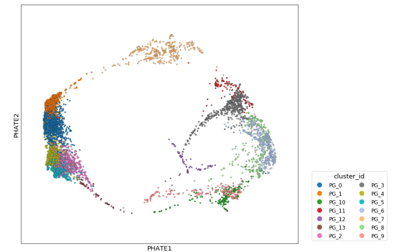
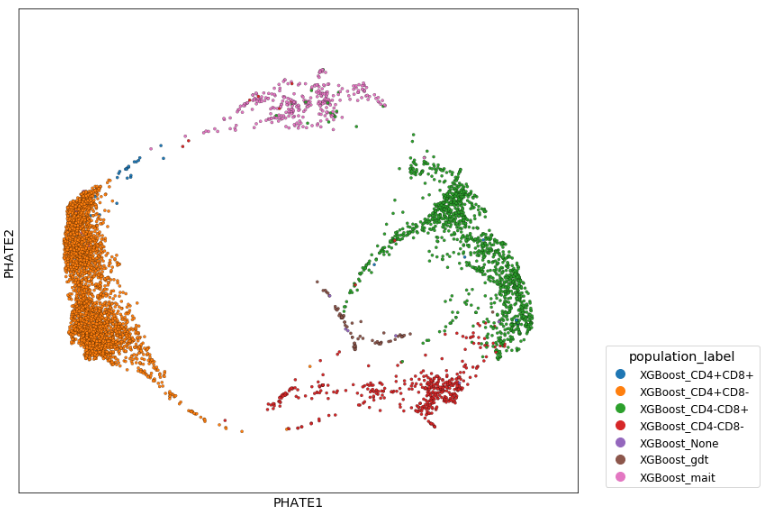
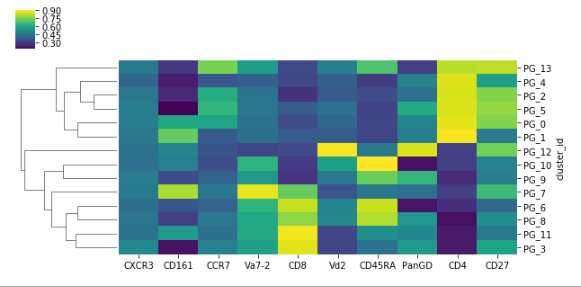
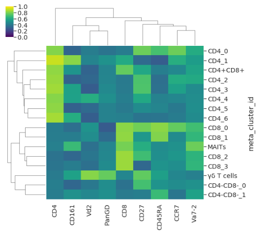
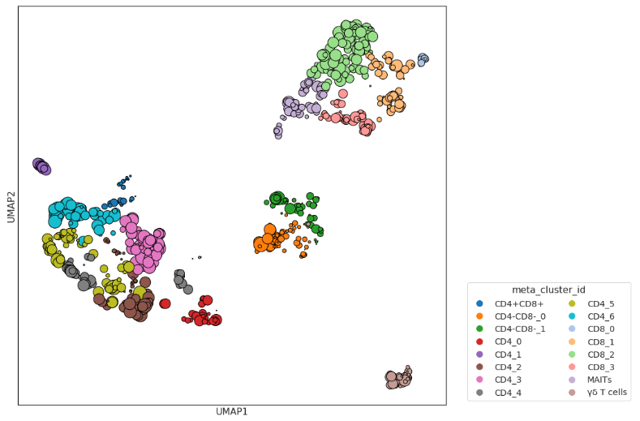
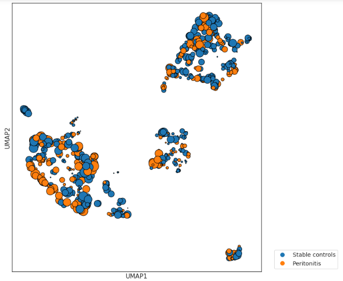

********************************************************************
Single-cell phenotype classification by high-dimensional clustering
********************************************************************

CytoPy supports the application of a clustering algorithm to any population, seperating cells into clusters of similar phenotype in high dimensional space. Currently CytoPy supports PhenoGraph clustering, FlowSOM, HDBSCAN, and any clustering/probablistic model currently offered through the Scikit-Learn *cluster* and *micture* modules. 

Clustering is implemented using the **Clustering** class and clustering is performed upon a chosen **Population** of each biological sample of an **Experiment**. The resulting clusters, represented by a **Cluster** object, is saved to the **Population** as an embedded document. Multiple instances of a clustering algorithm can be applied to the same population and the design of the MongoDB database makes it easy to contrast and compare populations (produced from both autonomous/manual gates and from supervised classifiers) with the results of clustering algorithms.

The Clustering class
=====================

The **Clustering** class is agnostic by design and will accept any clustering function from the *clustering* module, which we will discuss shortly. The object of the **Clustering** class is to handle all of the infrastructure around this process i.e. loading and saving data to the database.

We start by creating our **Clustering** object and providing it with an **Experiment** to work with::

	from CytoPy.data.project import Project
	from CytoPy.flow.ref import create_reference_sample
	pd_project = Project.objects(project_id='Peritonitis').get()
	exp = pd_project.load_experiment('PD_T_PDMCs')
	features=['CXCR3', 'CD161', 
		  'CCR7', 'Va7-2', 
		  'CD8', 'Vd2', 'CD45RA', 
		  'PanGD', 'CD4','CD27']
	clusterer = Clustering(experiment=exp,
				tag="My first clusterer",
				features=features,
				root_population="T cells",
				transform="logicle")
				
Few things to speak about here. If we don't provide the argument *sample_ids*, a list of identifiers for **FileGroup**'s, then **Clustering** will assume we want to study all the samples in this **Experiment**. We also provide the features, names of columns, we want to perform clustering with, what population to cluster on, and how to transform the data prior to clustering analysis. We also have to provide a 'tag' which acts as a unique identifier for clustering performed by this **Clustering** object.

This function will then load into memory the 'T cells' population from each FileGroup in the Experiment. If clusters already existed for the population 'T cells' for one or more FileGroups, then the cluster IDs will also be loaded into memory.

The data is stored within the *data* atrribute of clusterer. This attribute is a Pandas DataFrame where each row is a single cell, there is a column for each of the chosen features, and there are the following additional columns:

* sample_id: the identifier for the FileGroup the cell originated from
* original_index: the index the cell was at in the original FileGroup 
* cluster_id: the cluster identifier, will be None if no prior clustering performed under the given tag
* meta_label: any meta-clustering identifiers, again will be None if no prior clustering performed

We interact with the **Clustering** object with the following methods:

* cluster: clusters the events in *data* using a given function from the *clustering* module (see below). Functions take an argument *global_clustering*, if True, *data* is treated as a single entity and the clustering algorithm applied to all events, otherwise the data is grouped on sample_id and clusters are generated for each unique biological sample
* meta_cluster: perform meta-clustering using a given function from the *clustering* module (see below). By meta-clustering, we mean 'clustering the clusters'. Each cluster is summarised by mapping a function over their values and generating a summary vector that describes the cluster (by default Numpy's median function is used). The summary vectors are clustered to produce meta-clusters that groups similar clusters together, allowing alike clusters to be matched between biological samples.
* explore: generates an **Explorer** object for visualisation and exploratory analysis
* save: the results of the clustering are saved to the **FileGroup**(s)

Clustering functions
=====================

There are two different signatures for clustering functions in the *clustering* module: <some identifier>\_clustering and * <some identifier>\_metaclustering, the difference being that the latter is for, well...meta-clustering.

All of the general clustering functions take a dataframe, *data* and a list of features to cluster on *features*. These two required arguments are passed to the function automatically if called from the **Clustering** *cluster* method. As previously discussed, the *global_clustering* argument can be set to True to treat *data* as a single entity. Additional keyword arguments specific to the method used can then be provided as additional keyword arguments (see specific function API for details). In brief, the clustering functions are as follows:

* sklearn_clustering: access to any clustering/probablistic algorithm from Scikit-Learns cluster and mixture modules, as well as HDBSCAN. The class name to use should be given as a string value to *method* and the initialising parameters given as keyword arguments.
* phenograph_clustering: provides access to the population PhenoGraph algorithm (https://github.com/dpeerlab/PhenoGraph), see original documentation for additional keyword arguments to control clustering performance
* flowsom_clustering: an adaption of the FlowSOM algorithm (https://pubmed.ncbi.nlm.nih.gov/25573116/) using MiniSOM (see CytoPy.flow.clustering.flowsom for details)

Meta-clustering is provided by the following functions:

* sklearn_metaclustering: as with *sklearn_clustering*, this function provides access to any clustering/probablistic algorithm from Scikit-Learns cluster and mixture modules, as well as HDBSCAN, but performs meta-clustering as opposed to general clustering. 
* phenograph_metaclustering: same as the *phenograph_clustering* function but for meta-clustering
* consensus_metacluster: meta-clustering with the consensus clustering algorithm, as first described here: https://link.springer.com/content/pdf/10.1023%2FA%3A1023949509487.pdf. The optimal number of clusters is taken as a consensus amongst multiple rounds of clustering with random starts. The algorithm used for clustering should be given with *cluster_class* argument and should have the Scikit-Learn signatures for clustering i.e. fit_predict method

The metaclustering functions additionally take arguments *norm_method* and *norm_kwargs* which use the function CytoPy.flow.transform.scaler to normalise data, within each biological sample, prior to summarisation and meta-clustering. By default min max scaling is performed.

Clustering a single sample
===========================

To start simple, let's cluster a single FileGroup with PhenoGraph. Performing clustering is very easy, we start by initiating our clustering object and provide a single sample ID for the argument *sample_ids*::

		sclusterer = Clustering(experiment=exp,
					tag="My first clusterer",
					features=features,
					root_population="T cells",
					transform="logicle",
					sample_ids=[experiment.list_samples()[0]])

We simply call the *cluster* method to perform clustering whilst providing the *phenograph_clustering* function to do the heavy lifting::

	sclusterer.cluster(phenograph_clustering)

The *data* attribute of our object will be updated and the cluster IDs stored in the cluster_id column.

If we want to jump in and explore our clustering results, we can do so using the **Explorer** class...

Introducing exploratory data analysis with Explorer
====================================================

The **Explorer** class is the ultimate tool of exploratory data analysis in CytoPy. The **Clustering** has a method called *explore* that generates an **Explorer** object. The **Explorer** can be thought of as a wrapper to a Pandas DataFrame that brings immense data wrangling and visualisation power. **Explorer** houses either single cell data from a single biological sample and/or the results of meta-clustering in it's *data* attribute. It then contains many methods for visualising this data and exploring it interactively, as well as relating this data to patient metadata.

When the **Explorer** object is generated the data is populated with labels of the clustering results, **Population** labels for each single cell, and identifiers that relate each single cell back to the biological subject it originated from. Let's see an example of **Explorer** in action::

	# Generate the Explorer object
	explorer = sclusterer.explorer()

We can generate a dimensionality reduction plot using any of the methods in CytoPy.flow.dim_reduction (Linear PCA, non-linear PCA, UMAP, t-SNE, Isomap, and PHATE). We can specify to plot two components as a static two dimensional scatter plot or three components that will render automatically as a three-dimensional interactive plot::

	explorer.scatter_plot(label='cluster_id', 
		              features=['CXCR3', 'CD161', 
		                        'CCR7', 'Va7-2', 
		                        'CD8', 'Vd2', 'CD45RA', 
		                        'PanGD', 'CD4','CD27'], 
		              discrete=True, 
		              n_components=2, 
		              dim_reduction_method='PHATE',
		              matplotlib_kwargs={'s': 10, 'linewidth':0.2, 'edgecolor':'black'})

The results of dimensionality reduction are housed within the Pandas DataFrame as additional columns. The Pandas DataFrame can be saved to hard disk using the *save* method of **Explorer** and then an **Explorer** object created from loading that DataFrame::

	explorer.save('to_use_later.csv')
	explorer = Explorer(data='to_use_later.csv')

If we want to contrast the results of our clustering analysis with the results of a supervised classifier like XGBoost, we simply change the variable we want to label data points with::

	explorer.scatter_plot(label='population_label', 
		              features=['CXCR3', 'CD161', 
		                        'CCR7', 'Va7-2', 
		                        'CD8', 'Vd2', 'CD45RA', 
		                        'PanGD', 'CD4','CD27'], 
		              discrete=True, 
		              n_components=2, 
		              dim_reduction_method='PHATE',
		              matplotlib_kwargs={'s': 10, 'linewidth':0.2, 'edgecolor':'black'})

The performance is greatly increased because dimensionality reduction is only ever performed once and then the results stored and reused whenever the label is changed.

We can observe the phenotype of each cluster by using the *heatmap* method::

	explorer.heatmap(heatmap_var='cluster_id', 
		         features=['CXCR3', 'CD161', 
		                   'CCR7', 'Va7-2',
		                   'CD8', 'Vd2', 'CD45RA', 
		                   'PanGD', 'CD4','CD27'],
		        clustermap=True)

MetaClustering with PhenoGraph
===============================

It is all well and good clustering one biological sample, but we want to see what is happening across the range of subjects studied. To do this we need to contrast and compare the clustering results of each FileGroup, and that means matching similar clusters from different FileGroups together. This is where we apply meta-clustering. 

Let's create a new **Clustering** object, this time with all of our samples present. Then cluster and meta-cluster using PhenoGraph::

	clusterer = Clustering(experiment=exp,
				tag="PhenoGraph meta clustering",
				features=features,
				root_population="T cells",
				transform="logicle")
	clusterer.cluster(phenograph_clustering)
	clusterter.meta_cluster(phenograph_metaclustering,
				 summary_method=numpy.median,
				 normalise="norm")
				
The results are stored in the *data* attribute, just like before. The cluster IDs being in the cluster_id column but now additionally annotated with meta cluster IDs in the meta_label column. We can create an **Explorer** object again but this time explore the results of our meta clustering. Let's produce a heatmap of the phenotype of our meta-clusters. Remember, these clusters now represent the consensus of all our biological samples::

	explore = meta.explorer()
	features = [f for f in cd.features if f not in ['FSC-A', 'SSC-A']]
	explore.heatmap(heatmap_var='meta_cluster_id',
                	normalise=False,
                	clustermap=True,
                	col_cluster=True,
                	features=features,
                	figsize=(12,8))

It would be great if we could provide our clusters with more familar names. We can do this using the *rename_meta_clusters* method of our **Clustering** object::

	clusterer.rename_meta_clusters({'cluster_4': 'MAITs', 'cluster_9': 'γδ T cells' ...})

This can be done for each of our meta clusters. We can save the results of meta clusters to our database. Each cluster, for each biological sample, will have a field called "meta_label" that refers to it's associated meta cluster. ::
	
	clusterer.save()

Let's use the **Explorer** class to explore the newly labelled meta clusters::

	explore = clusterer.explorer()
	explore.heatmap(heatmap_var='meta_cluster_id',
		        clustermap=True,
		        col_cluster=True,
		        features=features,
		        figsize=(8,8),
		        vmin=0, 
			vmax=1)

The plots of CytoPy use common libraries:
* Heatmaps are produced using Seaborn
* Scatterplots in **Explorer** are produced using Scprep
* All other plots use Matplotlib

Additional keyword arguments that are common to these libraries can be given and will be passed to the call to Seaborn/Scprep/Matplotlib.

We can visualise meta clusters as a scatter plot where all clusters from all biological samples are shown after dimensionality reduction. The colour of the data point corresponds to it's meta cluster assignment and the size of the data point the proportion of cellular events relative to the biological sample the cluster originated from. The size of data points can be controlled using the 'meta_scale_factor' argument::

	explore.scatter_plot(label='meta_label', 
		             features=features, 
		             discrete=True, 
		             scale_factor=1000,
		             matplotlib_kwargs={'edgecolors': 'black',
		                                'linewidth': 1},
		             figsize=(15,10),
		             dim_reduction_method='UMAP'})

The crown jewl of CytoPy is its ability to easily and rapidly relate the results of complex cytometry analysis to the underlying clinical or experimental meta data. In the **Explorer** class we can load meta data using the *load_meta* method. We provide any field name in the **Subject** document that a column is amended to the Pandas DataFrame for that variable. Additionally we can load drug data, infection data, and other embedded data where multiple events of a variable exist for one patient (see CytoPy.flow.clustering.main.Explorer). 

Below is an example of loading the peritonitis variables, which specifies if a patient has peritonitis or not. We can then colour clusters according to this variable::

	explore.load_meta('peritonitis')
	explore.scatter_plot(label='peritonitis', 
                             features=cd.features, 
                             discrete=True, 
                             meta=True, 
                             meta_scale_factor=4000,
                             matplotlib_kwargs={'edgecolors': 'black',
                                                'linewidth': 1},
                             figsize=(12,10),
                             dim_reduction_method='UMAP')

