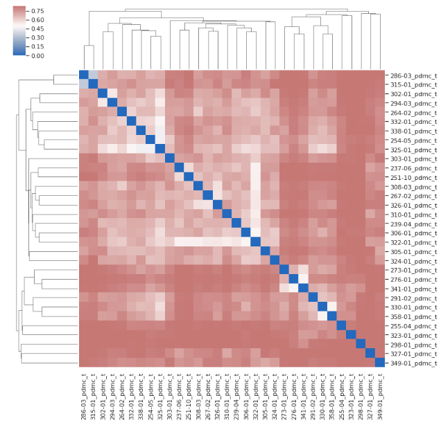

****************************
Assessment of batch effects
****************************

Unless all of your biological samples were processed at the same time and all cytometry data acquired in the same run, there will be inter-sample variation as a result of "batch effect". We recognised that it is important that we can explore and examine inter-sample variation prior to an extensive analysis.

Choosing a reference sample
=============================

CytoPy offers tools to visualise inter-sample variation. These tools contrast the variation in samples with a chosen reference sample. The reference sample is chosen as the sample that alligns closest to all other samples. We choose this reference sample using the *calculate_reference_sample* function or, preferably, using the *calculate_ref_sample_fast* function, an adapted version that uses multi-processing to speed up calculations.

These functions borrow the ideas presented in Li H et al (doi: 10.1093/bioinformatics/btx448). In brief, CytoPy performs a pairwise computation of the Euclidean norm of each sample’s covariance matrix, and selects the sample with the smallest average distance as reference. 

To generate a reference sample we simple pass an instance of **FCSExperiment** to the *calculate_ref_sample_fast* function::

	from CytoPy.data.project import Project
	from CytoPy.flow.supervised.ref import calculate_ref_sample_fast

	pd_project = Project.objects(project_id='Peritonitis').get()
	experiment = pd_project.load_experiment('PD_T_PDMCs')
	
	calculate_ref_sample_fast(experiment)
	# This returns the sample ID '325-01_pdmc_t', our reference sample

EvaluateBatchEffects
=====================

For all tasks involving our evaluation of batch effects in a single experiment, we turn to the **EvaluateBatchEffects** class. This gives us a central object for interacting with an experiment for these types of tasks. We initiate the object like so::
	
	samples = experiment.list_samples(valid_only=True)
	batch_effect = EvaluateBatchEffects(experiment=experiment,
					    root_population='T cells',
					    samples=samples,
					    transform='logicle',
					    sample_n=5000)

Above we first generate a list of samples to include in our investigations. We use the *list_samples* method of **FCSExperiment**. This includes an argument to exclude samples that have been flagged as "invalid".

We provide the **FCSExperiment** object. The name of some "root" population that has been identified in all samples prior to this. How we would like to transform our data prior to analysis (we go for the standard biexponential transform here) and finally how many events to sample from each biological sample. Downsampling is required because the tasks we undertake are computationall expensive and don't scale in terms of space complexity.

Visualising univariant differences
===================================

The first thing we might want to do is visualise the inter-sample variation for individual cell markers measured. We can do this by comparing the output of Gaussian KDE of each marker, for each sample, constrasted to the reference sample.

This is greatly simplified in CytoPy, which provides convenience functions for tasks such as this within the **EvaluateBatchEffects** class. To produce a grid of KDE plots, with samples overlaid on some reference sample we use the *marker_variance* function::

	batch_effects.marker_variance(reference_id='325-01_pdmc_t', 
		                      comparison_samples=comparisons,
		                      markers=['CD3', 'CD8', 'CD4', 
		                               'CD45RA', 'CD27', 'CCR7'])

We provide the sample ID for the reference sample, a list of samples to be compared to the reference sample (comparisons) and a list of markers to plot. This generates a grid of KDE plots, with the reference sample in the background and other samples overlaid:

.. image:: images/batch/kde.png

The number of markers and/or biological samples that can be included in any single plot are not limited, but the user should be cautious not to cloud plots.

Visualising multivariant differences
=====================================

If we want to see the multivariant shift in biological samples compared to some reference sample, we can observe this using the *dim_reduction_grid* function. As the name suggests, this applies dimensionality reduction, and the use can use any algorithm from CytoPy.flow.dim_reduction. 

The reduced projections of the reference sample are shown in each plot of the grid as a background and then for each plot a different biological sample is overlaid::

	batch_effects.dim_reduction_grid(reference_id='325-01_pdmc_t', 
					 comparison_samples=comparisons,
		                         features=markers,
					 method='PCA')

.. image:: images/batch/pca.png

Building a similarity matrix
=============================

It is useful to visualise inter-sample variation but it doesn't quantify it nor does it provide us with a stretegy to circumvent its effects. We're going to want to classify cells by phenotype using supervised methods, which is going to require that we label some training data. If there are extreme batch effects, this will influence how well our model generalises given the training data. For example, say we train the data on a reference sample that is significantly different to all other samples, then the trained model is going to perform poorly.

We have therefore developed something we call the "similarity matrix". This is a matrix of the pairwise statistical distance for all samples in an **FCSExperiment**. We use this "similarity matrix" to "group" samples (using single linkage clustering) and then we train an individual model for each group of similar samples.

We generate a similairty matrix like so::

	linkage_matrix, sample_ids, g = batch_effects.similarity_matrix(divergence_method='jsd', 
		                                                        exclude=experiment.list_invalid())

By default *similarity_matrix* uses Jenson-Shannon distance and this our recommended metrix (as discussed in the manuscript). 

This method outputs a few things. The first is a "linkage matrix", generated from the SciPy.cluster.hierarchy function, and is the result of single linkage clustering on the matrix of pairwise statistical distances. Second is an ordered list of sample IDs that correspong to the linkage matrix. Finally is a Seaborn.ClusterMap object. The plot is printed to stdout.

With this matrix produced we can group samples either heuristically (by visual inspection of the clustermap) or by using the linkage matrix and the *generate_groups* function found in the CytoPy.flow.batch_effects module::
	
	from CytoPy.flow.batch_effects import generate_groups
	groups = generate_groups(linkage_matrix=linkage_matrix,
				 sample_ids = sample_ids,
				 n_groups=3)

We provide this function with the output of the *similarity_matrix* method and it generates a Pandas DataFrame of group assignments. It does this by "cutting" the linkage matrix to form the number of clusters specified by "n_groups". In the above example it would generate 3 clusters or "groups" of similar samples.

