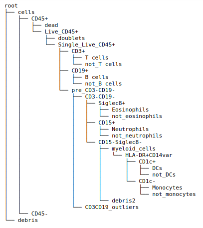
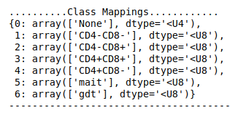
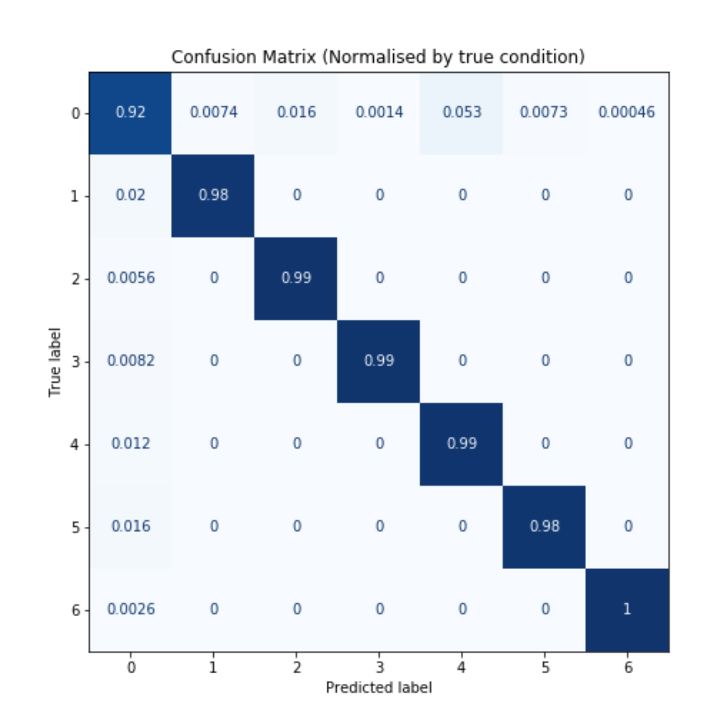
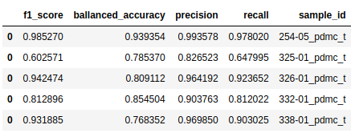
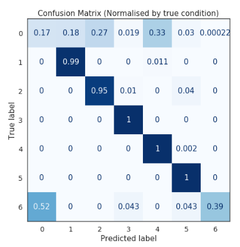
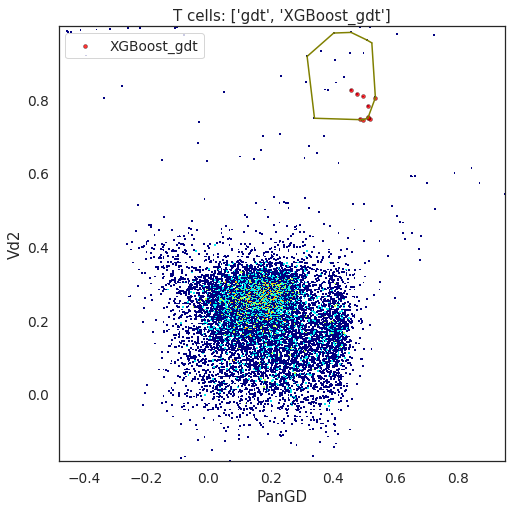

************************************************************
Single cell phenotype classification by supervised learning
************************************************************

There are many ways in which we can autonomously classify cells by their phenotype. CytoPy encourages the use of multiple methodologies by creating a single data repository in which the results of multiple methods can be stored and then contrasted.

One such method is supervised machine learning. Here, we label some representative data by manual or semi-autonomous gating, train a classifier, and then predict the classification for all remaining samples. 

How do we choose representative data as training data? In the section "Batch effect analysis" we discuss how we can generate a "similarity matrix" for an experiment and group samples according to some statistical distance metric. We then either choose or create a sample for each group to act as training data. A classifier is trained for each group.

We can choose a reference sample using the *calculate_ref_sample_fast* function (see "Batch effect analysis") or we can create a reference sample by taking a uniform sample of events from each member of our group::

	from CytoPy.flow.supervised.cell_classifier import create_reference_sample
	create_reference_sample(experiment=experiment,
				root_population='T cells',
				samples=group_1,
				new_file_name='group_1_training_data',
				sample_n=1000,
				verbose=True)

In the function call above, we pass in an instance of **FCSExperiment** (the experiment we are currently working on). We specify a root population that is true for each biological sample and is the population we will sample vents from. We specify a list of sample IDs to sample events from, here they are contained in the variable "group_1" which corresponds to a group derived as detailed in "Batch effect analysis". 

The function *create_reference_sample* doesn't return anything, instead it saves the new file to the experiment. It can then be retrieved and manipulated like any file in the experiment. We specify the file name with the argument "new_file_name". Lastly we specify how many events to sample from each biological sample.

A sample is used as training data by interpreting the populations currently associated to it. So if we take "group_1_training_data" and gate 10 populations using the **Gating** class (see "Pre-processing with autonomous gates"), we can then specify 10 (or less) of those populations to be "labels" in a classification task. This is all handled by the **CellClassifier** class detailed in the next section.

Introducing the CellClassifier
===============================

The **CellClassifier** class is the base class that all supervised classifiers inherit from in CytoPy. It handles the retrieval of population data from samples, the conversion of this data into "labels" for classification, and saving predictions. The predictions of a classifier are saved as **Population**'s no different to a **Population** defined by a gate. 

You might ask, well how do classifiers handle the multi-class structure of population tree's we see in cytometry data. Take the example below:

This is clearly a very complex population tree. If we wanted a classifier to identify the populations "CD3+" and "T cells", how would we do so when there are clearly overlaps? (A cell might fall inside the CD3+ gate but then not the T cell gate). **CellClassifier** overcomes this by labelling each cell with the "end node", that is the population that is furthest from the root population. The tree structure is stored within the label however, so a cell labelled as a T cell and starting at the root "Single_Live_CD45+" would have the label::

	'"Single_Live_CD45+","CD3+","T cells"'

When the predicted classifications are saved to in **Population**'s, the tree structure is recreated, such that the classified cell belongs to all three **Population**'s within its label.

The sample ID for the sample to use as training data and the target populations for prediction are given at the point of initialising a **CellClassifier** object. The user can also specify how to transform the data, whether additional scalling should be applied (e.g. min max normalisation or standard scaling) and specify how to handle issues such as class imbalance; class weights can be provided or a sampling procedure applied (see CytoPy.flow.supervised.cell_clasifier).

The **CellClassifier** object follows the conventions of Scikit-Learn and provides a familar API for training and prediction. The following methods provide all necessary for interacting with the model and are the same for all classifiers in CytoPy:

* build_model: this must be called prior to training or prediction; initiates the model and in the case of neural networks, it generates the architecture of the neural net
* train: trains the model using all available training data
* train_holdout: train the model and report performance on a specified proportion of data used as holdout data
* train_cv: train with cross validation over 'k' folds. Classification performance reported for each fold and as an average over all folds.
* gridsearch: implements Scikit-Learn GridSearchCV class. Provided a "hyperparameter grid" performs cross-validation; useful for hyperparameter tuning.
* predict: under the assumption that the model has been trained and given a sample ID within the associated experiment, predict the cell populations for that sample. Returns a **Gating** object for the sample containing the newly predicted populations. The user can then call *save* method on this **Gating** object to save the predictions.
* manual_validation: given a sample ID for a biological sample with the populations to be predicted already classified by some other method (e.g. manual or semi-autonomous gating), performs classification and performance given in comparison to the pre-existing populations

As mentioned before, all classifiers inherit from **CellClassifier** and hence following the structure detailed above. In CytoPy v0.0.1 the following classifier classes are available and they all use common libraries:

* KNN: k-nearest neighbours classifier (Scikit-learn)
* DeepGating: feed forward neural network (with customisable layers) implemented with Keras
* DiscriminantAnalysis: linear or quadratic discriminant analysis (Scikit-learn)
* SupportVectorMachine: support vector classifier (Scikit-learn)
* XGBoostClassifier: XGBoost classifier implemented with the Scikit-learn wrapper from the xgboost library

Training
=========

Taking XGBoostClassifier as an example, creating and training a model is simple. Note additional hyperparameters specific to a particular model are given when we call *build_model*. If we want to ry new hyperparameters with the same training data, we simply make a new call to *build_model* and this will overwrite the current classifier stored within the object::
	
	# Import dependencies 
	from CytoPy.flow.supervised import xgboost
	from CytoPy.data.project import Project

	# Load project data
	pd_project = Project.objects(project_id='Peritonitis').get()
	exp = pd_project.load_experiment('PD_T_PDMCs')

	populations = ['gdt', 'mait', 'CD4+CD8-', 
		       'CD4+CD8+', 'CD4-CD8+', 'CD4-CD8-']
	features = ['CD4', 'CD8', 'PanGD', 'Vd2',
		    'CD161', 'Va7.2', 'CD45RA', 
		    'CD27', 'CCR7']
	classifier = xgboost.XGBoostClassifier(experiment=exp,
					       reference_sample='Group1_Training',
                                       	       features=features, 
					       population_labels=populations,
                                               root_population='T cells')
	classifier.build_model()
	# Train with 30% of training data kept as holdout
	classifier.train_holdout(holdout_frac=0.3)

In **CellClassifier** there is a special output known as a 'report card'. If we specify to print the report card, it gives a detailed breakdown of classification performance. Doing this for *train_holdout* gives us a comparison between train and test data::

	classifier.train_holdout(holdout_frac=0.3, print_report_card=True)

This will provide classification performance metrics for each individual class for both test and train data, as well as confusion matrices such as the one below:

Validating
===========

When working with a new data set it is recommended that you validate the performance of your classifier by manually classifying multiple samples and assessing the performance using *manual_validation*. This method of **CellClassifier** returns a Pandas DataFrame of classification performance compared to the already existing populations. In the example below, the samples had already been classified by manual gating::

	validation_samples = ['254-05_pdmc_t',
			      '325-01_pdmc_t',
			      '326-01_pdmc_t',
			      '332-01_pdmc_t',
			      '338-01_pdmc_t']

	val_performance = pd.DataFrame()
	for v in g1_validation:
	    result = classifier.manual_validation(v, root_population='T cells')
	    result['sample_id'] = v
	    val_performance = pd.concat([val_performance, result])

The dataframe "val_performance" looks like this:

The poor performance of the outlier can be investigated further by printing the "report card"::

	classifier.manual_validation('325-01_pdmc_t', 
				      print_report_card=True, 
				      root_population='T cells')

This produces the following confusion matrix, showing that the poor performance stems from misclassification of gamma delta T cells and unclassified events:

Troubleshooting with backgating
=================================

We may want to investigate further as to how the cells classified as gamma delta T cells by XGBoost compare to those classified manually. Remeber how earlier we said that *predict* method returns a **Gating** object. We can use this **Gating** object and the *plotting.backgate* method to directly compare the "pseudo-gate" (predictions) of the XGBoost classifier with the manual gate::

	gates = classifier.predict('325-01_pdmc_t')
	gates.plotting.backgate(base_population='T cells', 
		                x='PanGD', 
		                y='Vd2', 
		                transforms={'x': 'logicle', 
		                            'y': 'logicle'},
		                poverlay=['XGBoost_gdt'], 
		                pgeoms=['gdt'])

"poverlay" specifies populations to 'overlay' as scatter points and "pgeoms" specifies populations to overlay as a 'polygon gate' calculated as the convex hull of the populations data points. The above gives us the following that displays how the "poor classification" is a result of this biological sample having reduced numbers of gamma delta T cells:

