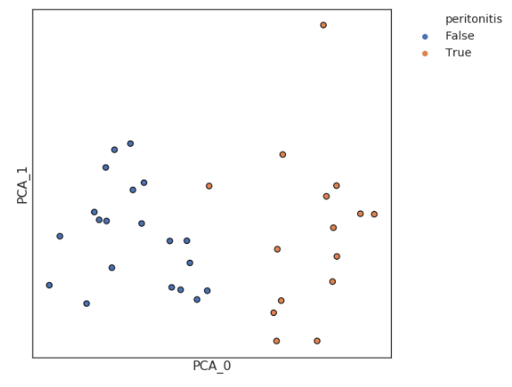
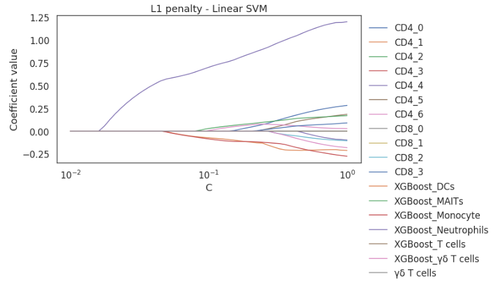

*************************************************
Feature extraction, selection, and summarisation
*************************************************

Once the biological samples of an experiment have been classified into phenotypically similar populations and/or clusters, we want to summarise these 'features' of the biological samples so that we can observe difference between clinical/experimental groups. CytoPy offers the feature extraction model for summarising the findings of an experiment and performing feature selection.

Summarising the proportion of cell populations/clusters
########################################################

The main class of interest in the feature extraction module is the **ExperimentalProportions** class. This class takes an experiment and list of samples to extract data from like so::

	from CytoPy.flow.feature_extraction import ExperimentProportions
	from CytoPy.data.project import Project
	pd_project = Project.objects(project_id='Peritonitis').get()
	exp = pd_project.load_experiment('PD_N_PDMCs')

	prop = ExperimentProportions(experiment=exp, samples=exp.list_samples())

**ExperimentalProportions** generates dataframes where each row is a biological sample and each column is a population or cluster statistic. Two types of statistics can be generated: the raw count of events within a cluster or a population or the proportion of events within a cluster or a population relative to the parent population that cluster or population was derived from. 

If we wanted a dataframe that summarises the meta clusters of an experiment we would do the following::

	# Load the clustering definition for the clusters we want
	cd = ClusteringDefinition.objects(clustering_uid='N_meta').get()
	# Create a list of clusters of interest
	clusters = ['Neutrophils', 'Monocytes', 'DCs', 'B cells', 'T cells', 'Eosinophils']
	pg_populations = prop.cluster_proportions(comparison_population='Single_Live_CD45+', 
		                                  clusters_of_interest=clusters, 
		                                  clustering_definition=cd, 
		                                  merge_associated_clusters=True)

By setting 'merge_associated_clusters' to True, the terms in 'clusters' will be searched for in all meta-clusters pulled from the experiment and clusters with like terms merged together (e.g. if the meta-clusters were ['Neutrophils_1', 'Neutrophils_2',...] then these would be merged into one cluster called 'Neutrophils').

If we wanted a dataframe that summarises the populations as predicted from XGBoost classification we would do the following::

	# Create a list of populations of interest, prefixed with XGBoost
	populations = ['Monocyte', 'Neutrophils', 'T cells', 'DCs', 'Eosinophils', 'B cells']
	populations = [f'XGBoost {p}' for p in populations]
	pop_props = props.population_proportions(parent='Single_Live_CD45+', 
						 populations_of_interest=populations)

You should see now how we have the tools to contrast and compare the results of multiple methodologies for cell phenotyping. We can also take the results of both clustering and supervised classification in this way and generate a consensus from both methods.

These tools help us build what we term a "feature space"; a matrix of 'features' that describe the cell populations of each biological sample (each row). But what if we want to label this feature space with some metadata, so that we had an additional column that corresponds to the clinical/experimental information we have on a biological sample and it's derived subject? This is made simple using the function *meta_labelling* from our feature extraction module::

	pop_props = meta_labelling(dataframe=pop_props, experiment=exp, meta_label='peritonitis')

Given a dataframe with a column named 'sample_id' and the **FCSExperiment** the data was derived from, the *meta_labelling* function searches the **Subject**'s for a given 'meta label' and adds an additional column to the dataframe corresponding to the subjects value for this variable.

Variance and Multicolinearity
##############################

Once we have built a 'feature space' we will want to remove any redundant variables. We can use two utility functions of the featrue extraction module:

* *sort_variance* - given a dataframe where columns correspond to features and rows the biological samples a sorted dataframe is returned ranking features from highest to lowest variance
* *multicolinearity_matrix* - given a dataframe where columns correspond to features and rows the biological samples, a multicolinearity matrix is plotted as a clustered heatmap. This will help identify variables that have high colinearity and where one might need removing.

Dimensionality reduction
##########################

A rapid method for detecting if there is a 'global' difference between two experimental or clinical groups is by using dimensionality reduction and plotting data points coloured according to their group. In the example below we differentiate patients with and without acute peritonitis. The dataframe 'summary' contains the proportion of cell populations identified by XGBoost and the proportion if clusters from all our experiments combined. We can use any method from CytoPy.flow.dim_reduction for the dimensionality reduction and a scatter plot is returned with data points coloured according to some label (here it is whether a patient has peritonitis or not)::
	
	from CytoPy.flow.feature_extraction import dim_reduction
	dim_reduction(summary=summary,label='peritonitis',scale=True,method='PCA')
	

Feature selection
###################

If the number of features is large and we want to narrow down which are of most value to predicting some clinical or experimental endpoint, we can use L1 regularisation in a sutiable linear model to do so. L1 regularisation, also known as 'lasso' regularisation, shrinks the coefficent of less important variables to zero, producing a more sparse model. By varying the regularisation term and oberving the coefficients of all our features, we can see which features shrink more rapidly compared to others. This serves as a helpful feature selection technique, giving us the variables important for predicting some clinical or experimental endpoint.

The feature extraction module contains a function for this called *l1_feature_selection*. This function takes the feature space, a dataframe of features where each row is a different biological sample and a 'label' column specifies the label to predict. We specify which features to include in our selection and the name of the label column to predict. The model takes a search space as a tuple. This is passed to Numpy.logspace to generate a range of values to use as the different L1 regularisation terms. The first value specifies the starting value and the second the end. The search space is a *n* values (where n is the third value in this argument) between the start and end on a log scale. 

Finally we also provide the model to use. This must be a Scikit-Learn linear classifier that takes an L1 regularisation term as an argument 'C'. If None is given then a linear support vector machine is used as default::

	l1_feature_selection(feature_space=summary,
		             features=features,
		             label='peritonitis',
		             scale=True,
		             search_space=(-2, 0, 50),
		             model=None)

Control comparisons
####################

If we have suitable control data we can use the **ControlComparison** class of the feature extractions module to generate additional variables. This can be helpful to clarrify certain findings, such as a change in a memory T cell population; if we had a control like a CD27 FMO, we could see if there is a difference between the control and the primary data. This is an experimental class at the moment and should be used with caution.

On initiation of a **ControlComparison** object with an experiment and some sample IDs, it checks that the samples listed have had their control populations predicted (see 'Using control data' under the section 'Pre-processing and autonomous gates'). If samples haven't been subjected to control gating, then this is performed automatically where control data is available.

**ControlComparison** currently has one method *statistic_1d* which calculates a statistic for one control for all samples. Currently it only supports relative fold change in MFI but we hope to include more statistics in the future as well as 2D or 3D statistics:

* 1D relative fold change in MFI: for each sample calculate the relative fold change in MFI between the control and the primary data for the variable that the control effects e.g. a CD27 FMO control would be relative fold change in MFI in CD27 between the primary data and the control

For more details see CytoPy.flow.feature_extraction.ControlComparison

