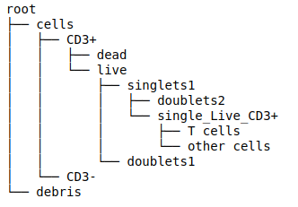
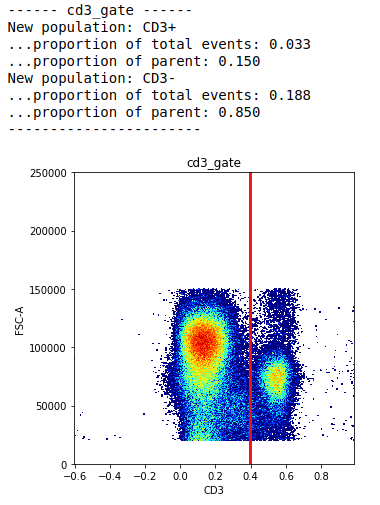
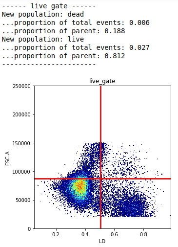
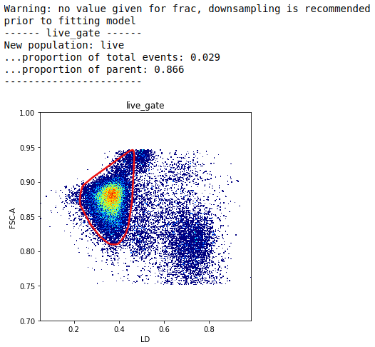
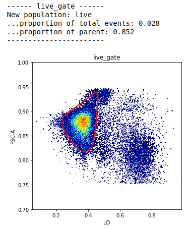
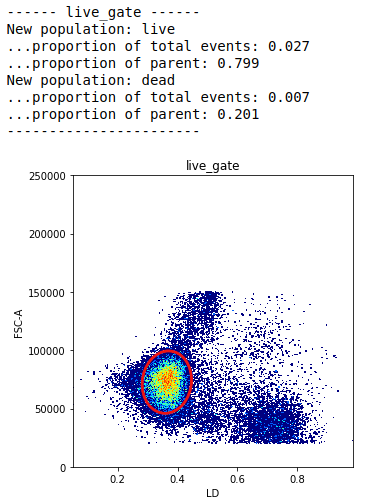
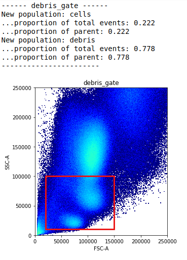
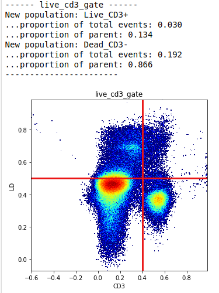
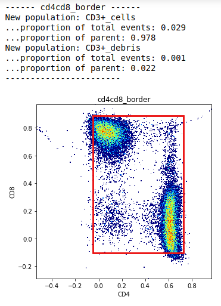
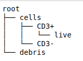

*************************************
Autonomous gating and pre-processing
*************************************

We were heavily inspired by the great work of OpenCyto, an autonomous gating framework developed for R Bioconductor. We recognised early on however, that autonomous gating is limited in it's capabilities. First of all, what do we mean by an "autonomous gate".

An autonomous gate is one that replicates the actions of a manual gate by applying some sort of algorithm to the same data in two dimensional space. Autonomous gates as a means of automated cytometry analysis have the following issues:

* Being a direct emulation of manual gating, they suffer from the same bias as a manually derived gating strategy
* Because the algorithm of choice is only ever applied to two-dimensional space, and therefore two variables as opposed to all available variables, the algorithm can struggle to generalise; if two biological samples deviate from one another signficantly this can result in abnormal results
* Building on the previous point, algorithms applied in this way don't take into consideration the "global topology" of the immunological landscape captured across all variables measured

This is why CytoPy focuses instead on using supervised machine learning and high-dimensional clustering that has access to all available variables when modelling the cytometry data.

Despite this, we decided to include automated gating as a function of CytoPy. The reason for this is that we found, no matter the quailty of data, some amount of 'gating' is required. Before we can classify cells autonomously we must remove debris, dead cells, and other artifacts. The efficiency and standardisation of this process can be greatly improved through the use of autonomous gates.

We actually refer to this as **semi-autonomous** gating, just for complete transparancy; some 'static' gates are often used in this task and to be honest, automated gates are not perfect and for about 10% of them some manual intervetion will be needed. We have created convenience functions to make the editing of gates easy.

Pre-processing normally follows these steps:

1. Design a gating **Template**
2. Apply that **Template** to each biological sample within an **FCSExperiment**
3. The **Template** generates **Population**'s as a result of this gating process and they are saved to the underlying database in each biological samples **FCSGroup**
4. The **Template** results in an 'identical' root population being generated for each biological sample e.g. T cells or CD45+ leukocytes. This root population is the point from which supervised classification and high-dimensional clustering take place.

A **Population** is generated whenever a gate is applied or when classified by some supervised classification algorithm. High-dimensional clustering algorithms can be applied to a **Population** and the resulting clusters saved within that **Population**

The Gating and Template class
###############################

The **Gating** class is central to CytoPy's design. It is the primary class used for accessing the biological samples contained within an experiment to create and apply gates, generate **Population**s and visualise data. The **Gating** class is very powerful and we recommend checking out the API reference for details (see CytoPy.gating.actions.Gating).

Often what we want to do is create a 'gating strategy': a sequence of gates applied to each biological sample, rendering the root population for each. We do this by using the **Template** class. This class directly inherits from the **Gating** class except it has the ability to save the gating sequence to the database for later use.

We initiate a **Template** object like so::

	project = Project.objects(project_id='Peritonitis').get()
	exp = project.load_experiment('PD_T_PDMCs')
	template = Template(experiment=exp, sample_id='286-03_pdmc_t', include_controls=True)

The arguments passed to **Template** are the same as those that would be passed to **Gating**. We provide **Template** with our **FCSExperiment** and the ID for the sample we want to load. For creating a gating template you should choose a biological sample that is fairly representative of all other samples in this experiment.

The *include_controls* argument specifies whether any associated control data should be loaded into the **Gating**/**Template** object. Later on we will see examples of how control data can be used.

Data is stored within the **Gating**/**Template** class as a Pandas DataFrame and can be accessed through the *data* parameter. The control data is stored as Pandas DataFrame(s) as well but is nested within a dictionary where the key is the control name.

Plotting a population
***********************

For every sample there will always be one population present by default. This is called the 'root' population. Not to be confused with what we refer to before. This 'root' is a population that contains all the events in an fcs file.

We can plot the 'root' population using the *plot_population* method. For all plotting tasks we access the embedded object **plotting**::

	template.plotting.plot_population(population_name='root', x='FSC-A', y='SSC-A', transforms={'x':None, 'y':None})

.. image:: images/gating/root.png

The transforms arugment is how we want to transform the x and y-axis. CytoPy supports all common data transformations for cytometry data (see CytoPy.flow.transforms). By default a biexponential transformation is applied.

Creating and applying a gate
*****************************

We first create a gate and then we apply that gate. Before we create a gate however, we must specify the populations that gate will generate. Below we are going to create a one dimensional threshold gate that captures CD3+ and CD3- populations. This gate used the properties of a probability density function formed by gaussian KDE to find a suitable threshold that seperates regions of high density. We need to tell our gate that we expect two populations as a result. We do this using the **ChildPopulationCollection**::

	from CytoPy.flow.gating.defaults import ChildPopulationCollection
	children = ChildPopulationCollection('threshold_1d')
	children.add_population('CD3+', definition='+')
	children.add_population('CD3-', definition='-')

The children object tells us:
* This is a 1D threshold gate
* It generates a population named 'CD3+' that is defined as being '+' (right of the threshold)
* It generates a population named 'CD3-' that is defined as being '-' (left of the threshold)

We can now create this gate by passing the children to the *create_gate* method::

	kwargs = dict(x='CD3', 
			transform_x='logicle', 
			kde_bw=0.05,
			peak_threshold=0.05)
	template.create_gate(gate_name='CD3_gate', 
		      parent='cells',
		      class\_='DensityThreshold',
		      method='gate_1d',
		      child_populations=children, 
		      kwargs=kwargs)

We specify the gate name, this is what we will use to refer to the gate in the future. The parent population that the gate is applied too. The type of gate we apply (class and method; see below for types of gates), the child populations produced, and the keyword arguments that are required for this gate type (again, see below for details)

Applying a gate, once created, is simple::

	template.apply('CD3_gate')

.. image:: images/gating/cd3.png

If we wanted to observe the populations currently associated to a **Gating**/**Template** object we call the *print_population_tree* method::

	template.print_population_tree()

The actions described above are exactly the same for a **Gating** object. The exception is that for a **Template** object we can save the gates to our database for later use::

	template.save_new_template('Preprocessing')

The **Template** can then be reloaded to apply to further samples::
	
	template = Template(experiment=exp, sample_id='new_sample', include_controls=True)
	template.load_template('PBMCt_Preprocessing')
	template.apply_many(apply_all=True, plot_outcome=True, feedback=False)

The *apply_many* method allows you to apply many or all gates to a sample.

Once we are happy with the gating results, we call the *save* method to save our populations to the database::

	template.save()

Types of Gates
###############

Gates fall into the following cateogores according to the type of geometric object they produce: threshold_1d, threshold_2d, cluster (polygon generated from clustering algorithm applied in two dimensions), and geom (ellipse and rectangles).

Each gate produces a **Geom** object that is saved to the **Population** and defines the 'space' in which that population is defined (e.g. the variables on the x and y axis, how they are transformed, and the coordinates in this space that "capture" the population of interest)

For every type of gate there is a class that inherits from the **Gate** class in CytoPy.flow.gating.base

Each gate and their class is detailed below. Code examples are given for creating and applying a gate. Reminder: in the examples below we create gates for **Template** object, but the commands are the same for a **Gating** object.

DensityThreshold
*****************

The **DensityThreshold** class can be applied in one or two dimensions. For each axis the probability density function is estimated using gaussian kernel density estimation (implemented with scikit-learn). The objective is to acquire a smooth function that describes the 'density' of our data. A peak finding algorithm (implemented with SciPy signal module) is applied and the region of minimum density between the two highest 'peaks' (regions of high density) is detected. This region of minimum density is taken as the threshold at which a gate is drawn. **Population**s are assigned to regions either side of the threshold based on how they were defined in the given **ChildPopulationCollection** object.

An example of creating an applying a one dimensional threshold::

	children = ChildPopulationCollection('threshold_1d')
	children.add_population('CD3+', definition='+')
	children.add_population('CD3-', definition='-')

	kwargs = dict(x='CD3',
		      y='FSC-A',
		      transform_x='logicle',
		      transform_y=None,
		      kde_bw=0.05)
	template.create_gate(gate_name='cd3_gate', 
		             parent='cells',
		             class_='DensityThreshold',
		             method='gate_1d',
		             child_populations=children, 
		             kwargs=kwargs)
	template.apply('cd3_gate')

An example of creating an applying a two dimensional threshold::

	children = ChildPopulationCollection('threshold_2d')
	children.add_population('Live_CD3+', definition='+-')
	children.add_population('Dead_CD3-', definition=['++', '--', '-+'])

	kwargs = dict(x='CD3',
		      y='LD',
		      transform_x='logicle',
		      transform_y='logicle',
		      kde_bw=0.05)
	template.create_gate(gate_name='live_cd3_gate', 
		             parent='cells',
		             class_='DensityThreshold',
		             method='gate_2d',
		             child_populations=children, 
		             kwargs=kwargs)
	template.apply('live_cd3_gate')

.. image:: images/gating/density_threshold_2d.png

Note the difference when defining the populations for the 2D gate. A definition such as '+-' denotes 'postive' (to the right of the threshold) in the x-axis plane and 'negative' (to the left of the threshold) in the y-axis plane. We can pass a list of definitions to merge quadrants.

See CytoPy.flow.gating.density for details

Quantile
*********

Similar to the **DensityThreshold** gating class **Quantile** gates generate threshold(s) in one or two dimensions. Therefore child population definitions are the same. **Quantile** gates however apply simple logic; thresholds are generated by taking some user defined quantile of the data in the x-axis/y-axis plane.

A one-dimensional gate::

	children = ChildPopulationCollection('threshold_1d')
	children.add_population('live', definition='-')
	children.add_population('dead', definition='+')

	kwargs = dict(x='LD',
		      y='FSC-A',
		      transform_x='logicle',
		      transform_y=None,
		      q=0.9)
	template.create_gate(gate_name='live_gate', 
		             parent='CD3+',
		             class_='Quantile',
		             method='gate_1d',
		             child_populations=children, 
		             kwargs=kwargs)
	template.apply('live_gate')

.. image:: images/gating/quantile_1d.png

A two-dimensional gate::

	children = ChildPopulationCollection('threshold_2d')
	children.add_population('dead', definition=['+-', '-+', '++'])
	children.add_population('live', definition='--')

	kwargs = dict(x='LD',
		      y='FSC-A',
		      transform_x='logicle',
		      transform_y=None,
		      q=0.9)
	template.create_gate(gate_name='live_gate', 
		             parent='CD3+',
		             class_='Quantile',
		             method='gate_2d',
		             child_populations=children, 
		             kwargs=kwargs)
	template.apply('live_gate')

DensityClustering
******************

The **DensityClustering** class implements the popular clustering algorithms `DBSCAN <https://scikit-learn.org/stable/modules/clustering.html#dbscan>_` and `HDBSCAN <https://hdbscan.readthedocs.io/en/latest/how_hdbscan_works.html>_` for the purpose of producing polygon gates for one or more populations in two-dimensional space. These algorithms recognise 'populations' (or 'clusters') as regions of high density seperated from regions of low density. They offer a unique advantage over other clustering algorithms such as k-means, in that they can recognise 'noise'; unclassified data points that occupy regions of low density. They also recognise clusters of any shape.

We include DBSCAN and it's successor HDBSCAN for completeness, but for practicallity we recommend the use of HDBSCAN for more robust clustering with less hyperparameter tuning.

When we define populations for these types of gates, we define the *gate_type* as 'cluster'. We can specify as many populations as we like and for each we provide two arguments:

* target: the estimated centroid of our target population; this doesn't have to be perfect, populations will be assigned to the cluster whom's centroid is closest to this estimated centroid
* weight: if more than one population is assigned to a single cluster, this weight parameter specifies which population is overarching importance. A higher value means the population is of more importance and will overwrite other populations assigned to the same cluster.

An example of DBSCAN::

	children = ChildPopulationCollection('cluster')
	children.add_population('live', target=(0.3, 0.8), weight=1)

	kwargs = dict(x='LD',
		      y='FSC-A',
		      transform_x='logicle',
		      transform_y='logicle',
		      min_pop_size=100,
		      distance_nn=0.01,
		      frac=None)
	template.create_gate(gate_name='live_gate', 
		             parent='CD3+',
		             class_='DensityClustering',
		             method='dbscan',
		             child_populations=children, 
		             kwargs=kwargs)
	template.apply('live_gate', 
			plotting_kwargs={'ylim': (0.7, 1),
			'transforms': {'x': 'logicle', 
					'y': 'logicle'}})

Note two things above:
* We transform the x and y axis, even though the y-axis is forward scatter light. This is important because DBSCAN is sensitive to the range of values on the x and y-axis
* Because we have transformed the axis, we want this to reflect in the plotted outcome of our *apply* call. Plots that contains forward or sideward scatter will default to a range of 0 to 250000, but we have transformed these axis so we want to reduce this range. We provide additional arguments in *plotting_kwargs* to pass this onto the call to *plot_gate* that visualises our results

An example of HDBSCAN::

	children = ChildPopulationCollection('cluster')
	children.add_population('live', target=(0.3, 0.85), weight=1)

	kwargs = dict(x='LD',
		      y='FSC-A',
		      transform_x='logicle',
		      transform_y='logicle',
		      min_pop_size=100,
		      frac=None)
	template.create_gate(gate_name='live_gate', 
		             parent='CD3+',
		             class_='DensityClustering',
		             method='hdbscan',
		             child_populations=children, 
		             kwargs=kwargs)
	template.apply('live_gate', 
		       plotting_kwargs={'ylim': (0.7, 1), 
		                        'transforms': {'x': 'logicle', 
		                                       'y': 'logicle'}})

See CytoPy.flow.gating.dbscan for further details

MixtureModel
*************

The **MixtureModel** class implements gaussian mixture models for generating an elliptical gate that targets a single population. A gaussian mixture model is a probabilistic model that assumes the observed data is a result of a mixture of finite gaussian distributions with unknown parameters. Given some presumed center of a target population (the *target* argument in the code below), **MixtureModel** will fit a gaussian mixture model to the target data and then extract the component whom's center is closest to the target center. A confidence ellipse is drawn around this component and is used as the 'gate'. The size of the ellipse can be adjusted by providing a confidence parameter (e.g. *conf=0.95* draws an ellipse equivalent to a 95% confidence interval).

**MixtureModel** is a *geom* gate, in that it produces a single shape and the contents of that shape is what is considered "positive". This is reflected in how we define the **ChildPopulationCollection**::

	children = ChildPopulationCollection('geom')
	children.add_population('live', definition='+')
	children.add_population('dead', definition='-')

	kwargs = dict(x='LD',
		      y='FSC-A',
		      transform_x='logicle',
		      transform_y=None,
		      target=(0.3, 85000),
		      conf=0.95)
	template.create_gate(gate_name='live_gate', 
		             parent='CD3+',
		             class_='MixtureModel',
		             method='gate',
		             child_populations=children, 
		             kwargs=kwargs)
	template.apply('live_gate')

The **MixtureModel** implements scikit-learn and a user can specify whether to use a gaussian mixture or variational bayesian gaussian mixture. See CytoPy.flow.gating.mixturemodel for details.

Static
*******

In addition to what we have seen already with autonomous gates, we also have the option to use static gates that don't change in accordance to the data presented. These are implemented with the **Static** class. Some examples of these are given below.

Example of a static rectangular gate::

	children = ChildPopulationCollection('geom')
	children.add_population('cells', definition='+')
	children.add_population('debris', definition='-')

	kwargs = dict(x='FSC-A',
		      y='SSC-A',
		      transform_x=None,
		      transform_y=None,
		      x_min=20000,
		      y_min=10000,
		      x_max=150000,
		      y_max=100000)
	template.create_gate(gate_name='debris_gate', 
		             parent='root',
		             class_='Static',
		             method='rect_gate',
		             child_populations=children, 
		             kwargs=kwargs)
	template.apply('debris_gate')

Example of a static elliptical gate::

	children = ChildPopulationCollection('geom')
	children.add_population('Live_CD3+', definition='+')
	children.add_population('Dead_CD3-', definition='-')

	kwargs = dict(x='CD3',
		      y='LD',
		      transform_x='logicle',
		      transform_y='logicle',
		      centroid=(0.55, 0.35),
		      width=0.35,
		      height=0.2,
		      angle=0)
	template.create_gate(gate_name='live_cd3_gate', 
		             parent='cells',
		             class_='Static',
		             method='ellipse_gate',
		             child_populations=children, 
		             kwargs=kwargs)
	template.apply('live_cd3_gate')

.. image:: images/gating/ellipse.png

Example of a static threshold gate::

	children = ChildPopulationCollection('threshold_2d')
	children.add_population('Live_CD3+', definition='+-')
	children.add_population('Dead_CD3-', definition=['++', '--', '-+'])

	kwargs = dict(x='CD3',
		      y='LD',
		      transform_x='logicle',
		      transform_y='logicle',
		      threshold_x=0.4,
		      threshold_y=0.5)
	template.create_gate(gate_name='live_cd3_gate', 
		             parent='cells',
		             class_='Static',
		             method='threshold_2d',
		             child_populations=children, 
		             kwargs=kwargs)
	template.apply('live_cd3_gate')

The last example is a special type of static gate known as a *border_gate*. If you have data where you know that there are anomolies scattered around the extremes of two variables, this can be useful to remove them. It creates a rectangular gate that is defined using some lower and upper quantile::

	children = ChildPopulationCollection('geom')
	children.add_population('CD3+_cells', definition='+')
	children.add_population('CD3+_debris', definition='-')

	kwargs = dict(x='CD4',
		      y='CD8',
		      transform_x='logicle',
		      transform_y='logicle',
		      bottom_cutoff=0.01,
		      top_cutoff=0.999)
	template.create_gate(gate_name='cd4cd8_border', 
		             parent='Live_CD3+',
		             class_='Static',
		             method='border_gate',
		             child_populations=children, 
		             kwargs=kwargs)
	template.apply('cd4cd8_border')

Using control data
###################

We mentioned before that the **Gating** class loads in control data, but why? Well we can use this control data for confirmation of certain observations, for example if we see a 'drift' in a population we might use an isotype or flourescence minus one control to confirm that drift is of biological origin.

In the feature extraction module of CytoPy we'll see ho we can use controls to measure relative fold change in MFI and calculate earth mover's distance amongst other statistical distance measures to show the change between the primary measurement and some control.

In order to do this however, controls have to have the same gating strategy applied to them to derive the populations of interest. We recognise that this is compuationally expensive and therefore we have created the *control_gating* function in **Gating** to 'predict' the assignment of control data to populations identified in the primary data.

We make the assumption that data for controls was collected from the same source sample and under the same conditions (minus the abscence of a stain for example) as the primary data. We therefore assume that the primary data makes for adequate training data for a supervised learning approach. The *control_gating* function transverses the population tree of the primary data and for each population trains either a K-nearest neighbours or support vector machine classifier using the two dimensional data from the primary data set (e.g. if CD3+ cells were defined using the variables CD3 and FSC-A, then these variables are used to train the classifier). Each population is predicted in sequence following the gating strategy applied to the primary data.

Let's see an example. First we can print the population tree for a sample that's already been gated for a few populations::

	template.print_population_tree()

Then we can inspect what control data we have by looking at the keys of the control dictionary loaded into this **Gating**/**Template** object::

	template.ctrl.keys()
	# Returns: dict_keys(['CD27', 'CD45RA', 'CCR7'])

Let's predict the populations in the population tree for the CD27 and the CD45RA controls. We specify which control we want to predict populations for and the model of choice. This wraps around scikit-learn implementations so arguments mirror that of native scikit-learn objects::

	template.control_gating(ctrl_id='CD27',
		                model='knn',
		                n_neighbors=10,
		                n_jobs=-1,
		                algorithm='ball_tree')

	template.control_gating(ctrl_id='CD45RA',
		                model='knn',
		                n_neighbors=10,
		                n_jobs=-1,
		                algorithm='ball_tree')

We can then plot our control populations in comparison to the population in the primary data using the *compare_control* plotting function::

	template.plotting.compare_control(population='live',
		                          ctrl_id=['CD27', 'CD45RA'],
		                          x='LD',
		                          y='FSC-A',
		                          transforms={'x': 'logicle',
						      'y':None})

.. image:: images/gating/control.png

Editing gate
#############

We admitted before that automated gates are not perfect. There will of course always be outliers in our biological samples (it is biology after all...). CytoPy comes well equiped for troubleshooting and editing errors. 

To edit a gate we use the *edit_gate* function. First, for each population that a gate generates we fetch it's 'geom' (the gating info that defined that population). We then edit the 'geom' as we see fit and pass this into *edit_gate* to apply our changes::

	cd3_pos = gating.fetch_geom('cd3+')
	cd3_neg = gating.fetch_geom('cd3-')
	
	cd3_pos['threshold_x'] = 0.6
	cd3_neg['threshold_x'] = 0.6

	gating.edit_gate('cd3_gate', 
			 updated_geom={'cd3+': cd3_pos,
				       'cd3-': cd3_neg})

The *edit_gate* function allows for editing any gate type, but for threshold gates there is an even more convenient function called *nudge_threshold*. This is a bit of a short-cut compared to the above. We simple state the name of the gate and the new x and/or y threshold to apply::

	gating.nudge_threshold('cd3_gate', new_x=0.6)

Other worthy mentions
######################

I hope we have demonstrated so far that the **Gating** class is very powerful and we recommend reading the the API reference at CytoPy.flow.gating.actions for more details.

As for other functions contained within **Gating**, worthy mentions are:

* get_population_df: given a population name, returns the Pandas DataFrame of events within the population. Has options to transform the data according to any of the transform function avaiable in CytoPy.flow.transforms. Also has an option to label events according to the downstream populations they belong too. If a value for *ctrl_id* is provided, the equivalent population in the given control is returned instead of the primary data
* population_size: returns the total number of events within a population
* merge: given two populations with the same parent, creates a new gate and a resulting population that is the merger of these two populations
* subtraction: given a target population and any number of other populations that share the same parent, subtract the other populations from the target, generating a new population. The defintion is saved within a gate and can be saved within a template.
* remove_population: removes a population and all downstream dependencies (optional but recommended)
* remove_gate: removes a gate and, if specified to do so, removes all associated populations
* register_as_invalid: registers the currently loaded sample as invalid and saves flag to database
* check_downstream_overlaps: checks if a population is downstream to any number of other populations

